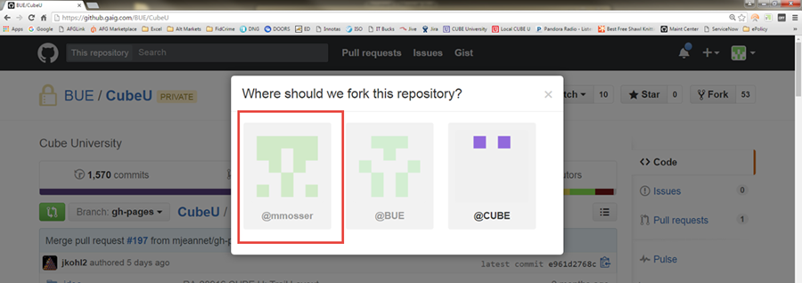
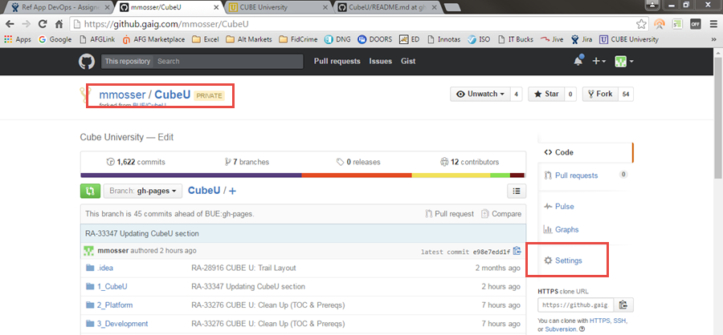
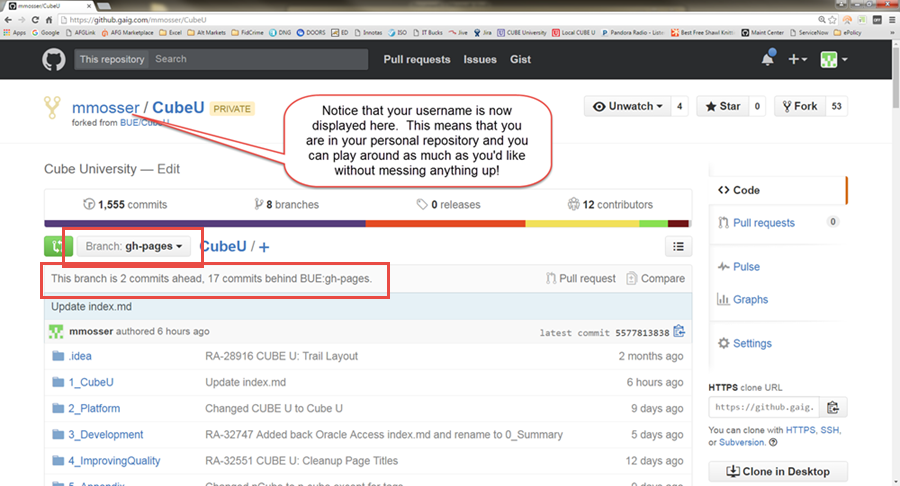



## Introduction
Great American uses an online site called GitHub (a "source code repository") to house all of the code for the CUBE project
(as well as some others). Because Cube U was created so that we could hold our knowledge content to the same high standards as
our source code, its content is *also* housed in GitHub.  *Your* knowledge is an **extremely** valuable asset, so we treat it as such!

This section will show you how to copy (or "fork" in Git terms) the Cube U content to your own, personal repository in GitHub. This
will allow you to make changes and test your content updates without affecting the "official" version of Cube U. Play around
and have fun!

## Prerequisites

* You'll need access to the "BUE" organization in GitHub.  Take a look at the Prerequisites on the **Start Contributing to CUBE U**
page for assistance with this.
* **Do you already have a personal fork of Cube U?**  If so, you can probably skip this step, just make sure you follow the steps
outlined in the "Keeping Your Fork Up-to-Date" section in the **Create or Update Cube U Content** page.  Another option (say if
your fork is old and you haven't updated in a while) is to just delete your current fork and start over with the steps below. See "How to Delete a Fork"
below for instructions on how to do this.

## Steps

1. Navigate to <https://github.gaig.com/login> and login with your ED credentials (this is the username and password you
use to log into your computer)

2. Once you're logged in, you can easily navigate to the Cube U repository by adding "/BUE/CubeU" to the end of your URL (<https://github.gaig.com/BUE/CubeU>).

    Your page will look something like below.  Note that this is the "official" version of Cube U...the real deal.

    Before continuing, just make sure that your **Branch:** drop-down says **gh-pages**.  If it doesn't, change it accordingly.

    {: .image}

3. Click the **Fork** button in the upper, right corner

    {: .image}

4. When prompted, select the repository that is your username (i.e. @mmosser)

    {: .image}

5. After the BUE Cube U repository is done forking to your personal repository, you should see a page like this...again,
make sure your  **Branch:** drop-down is set to **gh-pages** before continuing.

    {: .image}

**Now you're ready to start creating or updating content!**

## How to Delete a Fork

**You don't need this information for initial setup**, so you can skip this content unless you need it.

Make sure that you don't have any commits or pushes that you don't want to lose.  And, as always, make sure you're on
your own personal fork on the gh-pages branch before continuing.

1.  While on your own fork, click **Settings**

    {: .image}

2. Scroll down to the **Danger Zone** and click **Delete this repository**

    {: .image}

3. If you're sure, type in the name of the repository and click **I understand the consequences, delete this repository**

    {: .image}

## FAQ

**What do I do if I just want to test that I've done everything correctly? How can I see my rendered fork of Cube U before I start adding
my own content?**

Before you can render the site on your fork, there's just one little quirk...you have to make a change (*any* change) to your fork's
content so that the site is triggered to generate. This can literally just be a space somewhere if you don't yet feel comfortable making
major changes.

The next page, **Create or Update Cube U Content** includes instructions on how to update content, so you can just follow those steps
but perhaps just add a space in an inconspicuous place...preferably in an area where you intend to contribute content anyway.

Then, to see what your rendered fork looks like, take a look at the "Test Your Rendered Content" section of the **Create or Update Cube U Content**
page.

**What if there are changes to the "official" Cube U after I fork, but before I am done working on my content?**

This is very likely to happen as there are more and more active contributors on Cube U. This is why it is **extremely** important
to regularly make sure that you are keeping your fork up-to-date with BUE: gh-pages. To get up-to-date with BUE: gh-pages, follow
the steps outlined in the "How to Keep Your Fork Up to Date" section in the **Create or Update Cube U Content** page.

**How do I know if I have the most recent version of Cube U in my personal repository?**

Make sure you are on your own fork, on the gh-pages branch, then look beneath the branch drop-down.  There, you can see where your branch stands
in relation to BUE: gh-pages.  In the example below, the personal fork is "17 commits behind BUE: gh-pages".  This means that an
update is definitely necessary.  You don't want to be "behind" BUE: gh-pages for very long and *certainly* not when making pushes
or Pull Requests. To get up-to-date, follow the steps outlined in the "Keeping Your Fork Up-to-Date" section in the **Create or
Update Cube U Content** page.

{: .image}

## For Further Reading

* None

