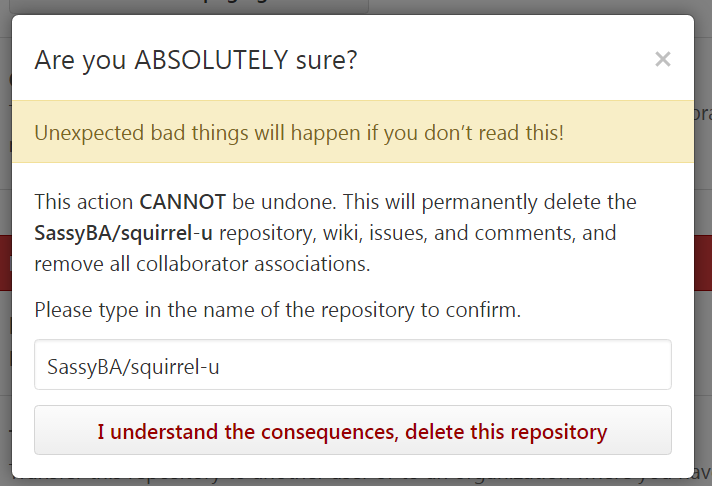



## Introduction
SquirrelWorks uses an online site called GitHub (a "source code repository") to house all of the code for its application projects. Because
Squirrel U was created so that we could hold our knowledge content to the same high standards as
our source code, its content is *also* housed in GitHub.  *Your* knowledge is an **extremely** valuable asset, so we treat it as such!

This section will show you how to copy (or "fork" in Git terms) the Squirrel U content to your own, personal repository in GitHub. This
will allow you to make changes and test your content updates without affecting the "official" version of Squirrel U. Play around
and have fun!

## Prerequisites

* **Do you already have a personal fork of Squirrel U?**  If so, you can probably skip this step, just make sure you follow the steps
outlined in the "Keeping Your Fork Up-to-Date" section in the **Create or Update Squirrel U Content** page.  Another option (say if
your fork is old and you haven't updated in a while) is to just delete your current fork and start over with the steps below. See "How to Delete a Fork"
below for instructions on how to do this.

## Steps

1. Navigate to <https://github.com> and login with your GitHub credentials

2. Once you're logged in, navigate to the Squirrel U repository (<https://github.com/zippyzsquirrel/squirrel-u>).

    Your page will look something like below.  Note that this is the "official" version of Squirrel U...the real deal.

    Before continuing, just make sure that your **Branch:** drop-down says **gh-pages**.  If it doesn't, change it accordingly.

    {: .image}

3. Click the **Fork** button in the upper, right corner

4. After the Squirrel U repository is done forking to your personal repository, you will be taken to your forked repo...again,
make sure your  **Branch:** drop-down is set to **gh-pages** before continuing.

    {: .image}

**Now you're ready to start creating or updating content!**

## How to Delete a Fork

**You don't need this information for initial setup**, so you can skip this content unless you need it.

Make sure that you don't have any commits or pushes that you don't want to lose.  And, as always, make sure you're on
your own personal fork on the gh-pages branch before continuing.

1.  While on your own fork, click **Settings**

2. Scroll down to the **Danger Zone** and click **Delete this repository**

3. If you're sure, type in the name of the repository and click **I understand the consequences, delete this repository**

    {: .image}

## FAQ

**What if there are changes to the "official" Squirrel U after I fork, but before I am done working on my content?**

This is very likely to happen as there are more and more active contributors on Squirrel U. This is why it is **extremely** important
to regularly make sure that you are keeping your fork up-to-date with Zippy's repo. To get up-to-date, follow
the steps outlined in the "How to Keep Your Fork Up to Date" section in the **Create or Update Squirrel U Content** page.

**How do I know if I have the most recent version of Squirrel U in my personal repository?**

Make sure you are on your own fork, on the gh-pages branch, then look beneath the branch drop-down.  There, you can see where your branch stands
in relation to Zippy's.  In the example below, the personal fork is "This branch is even with zippyzsquirrel:gh-pages.".  This means that an
update is not necessary because your fork has the same exact content as Zippy's.  You don't want to be "behind" Zippy's repo for very long and *certainly* not when making pushes
or Pull Requests. To get up-to-date, follow the steps outlined in the "Keeping Your Fork Up-to-Date" section in the **Create or
Update Squirrel U Content** page.

{: .image}

## For Further Reading

* None

