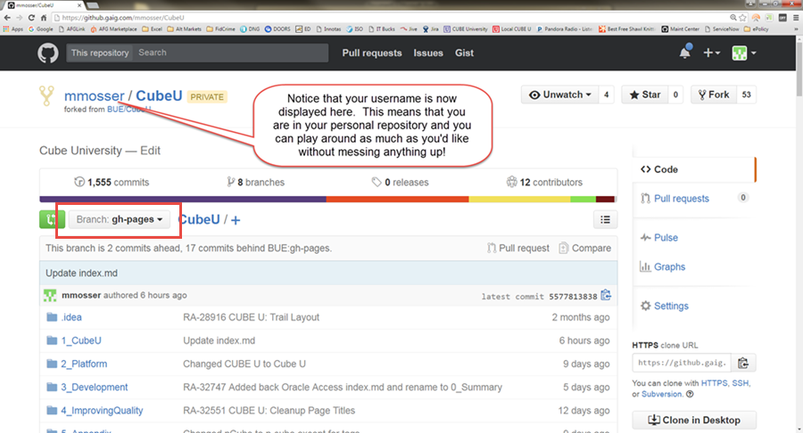



## Introduction

This section will show you how to send your changes to an approver for review (this is called a "pull request" in GitHub terms).
If your changes are approved (meaning that they meet all Squirrel U content standards and they are accurate), your content will be
added ("merged" in Git terms) to the "official" Squirrel U content.  If the approver has any questions, suggestions or feedback, GitHub
makes it easy to discuss these items and make changes until it's all worked out.

## Prerequisites

* You'll need access to the "BUE" organization in GitHub.  Take a look at the Prerequisites on the **Get Started Contributing to Squirrel U**
page for assistance with this.
* *Always* make sure that your fork is up to date with the most recent changes in BUE. For assistance with this, follow the steps
outlined in the "Keeping Your Fork Up-to-Date" section in the **Create or Update Squirrel U Content** page.
* Make sure that you are within your personal repository (not the "BUE" repo) and that your branch is **gh-pages**.  After
you have logged into GitHub, this is as simple as adding "/yourUsername/SquirrelU" to your URL (i.e. https://github.gaig.com/mmosser/SquirrelU).

{: .image}

## Steps

1. Click **Pull request** from your personal repository.

    {: .image}

2. Click **Create pull request** to create your request for review.

    {: .image}

3. Give your Pull Request a title (something simple that generally explains your changes).  If you'd like, you can also leave
more detailed comments about your content or a message to the reviewer.  Click **Create pull request** when you're ready to send
it off.

    {: .image}

You should be hearing back very soon from an approver with feedback. If your content is approved without feedback, you
might just get an automated email from GitHub stating that your content has been merged.

**That's it! Thank you for contributing to Squirrel U!**

## FAQ

**How can I view my Pull Request after it's been submitted?**

Navigate to the BUE/SquirrelU repository and click on the **Pull requests** tab on the right side. All open PRs will be displayed here.
You can also view any closed PRs by clicking the **Closed** tab.  You can find more information on Pull Requests in the **Pull Request and Review**
page, including how to make comments or request additional reviewers.

{: .image}

**What if I notice something is wrong after I've created a Pull Request?**

No problem, just make your change and commit. All of your subsequent changes will be added to your open Pull Request. If your
Pull Request get closed before you have a chance to make the update, just create a new Pull Request when you're ready.

**What if the reviewer has feedback or requests changes to my Pull Request**

Just make your changes and commit. All of your subsequent changes will be added to your open Pull Request and the
reviewer will be able to see the updates.

**Do I have to take changes that the reviewer recommends? It's my content after all...**

It depends on what the recommendations are.

If it has anything to do with the documented Squirrel U standards, then yes.  Squirrel U
reviewers are in charge of making sure that content integrated into Squirrel U is formatted and consistent with all guidelines. Squirrel U's
standards are documented throughout Squirrel U's **Orientation** section, but for a quick reference, we have created a checklist of items that
reviewers should look for before approving Pull Requests. You can also see this checklist on the **Squirrel U Guidelines Checklist** page.
Making sure that you have adhered to these guidelines as much as possible should expedite the approval of your content.

There are other grey areas such as content accuracy or perhaps writing style where you may get feedback that you disagree with. In
this case, it is ok to have a healthy discussion about how to move forward. GitHub makes it easy to work through these feedback loops with
the comments feature, where you can also pull in other people with @username to get their opinions as well.

Remember that the spirit of Squirrel U is treating our knowledge content as an asset similar to our source code, which is why we have
a review process and feedback loop utilizing a Pull Request model. To read more about Squirrel U's motivation and goals,
take a look at the **About Squirrel U** page.

**Who exactly is reviewing my Pull Request?**

Squirrel U is *currently* reviewed by a limited audience (DevOps).  Eventually, the review list will expand to a larger curation group
consisting of subject matter experts across various areas (Architects, Developers, Analyst, DevOps, etc.).  This group will
ultimately be responsible for continuing to review content for technical and conceptual accuracy, placement and adherence to Squirrel U
guidelines.

## For Further Reading

* None