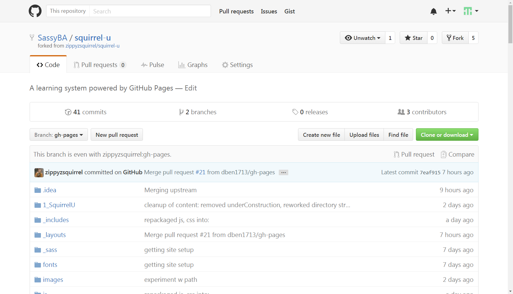



## Introduction

This section will show you how to send your changes to an approver for review (this is called a "pull request" in GitHub terms).
If your changes are approved (meaning that they meet all Squirrel U content standards and they are accurate), your content will be
added ("merged" in Git terms) to the "official" Squirrel U content.  If the approver has any questions, suggestions or feedback, GitHub
makes it easy to discuss these items and make changes until it's all worked out.

## Prerequisites

* *Always* make sure that your fork is up to date with the most recent changes in Zippy's repo. For assistance with this, follow the steps
outlined in the "Keeping Your Fork Up-to-Date" section in the **Create or Update Squirrel U Content** page.
* Make sure that you are within your personal repository and that your branch is **gh-pages**.

## Steps

1. Click **Pull request** from your personal repository.

    {: .image}

2. Click **Create pull request** to create your request for review.

    {: .image}

3. Give your Pull Request a title (something simple that generally explains your changes).  If you'd like, you can also leave
more detailed comments about your content or a message to the reviewer.  Click **Create pull request** when you're ready to send
it off.

    {: .image}

You should be hearing back very soon from an approver with feedback. If your content is approved without feedback, you
might just get an automated email from GitHub stating that your content has been merged.

**That's it! Thank you for contributing to Squirrel U!**

## FAQ

**How can I view my Pull Request after it's been submitted?**

Navigate to the Zippy's repository and click on the **Pull requests** tab. All open PRs will be displayed here.
You can also view any closed PRs by clicking the **Closed** tab.  You can find more information on Pull Requests in the **Pull Request and Review**
page, including how to make comments or request additional reviewers.

**What if I notice something is wrong after I've created a Pull Request?**

No problem, just make your change and commit. All of your subsequent changes will be added to your open Pull Request. If your
Pull Request get closed before you have a chance to make the update, just create a new Pull Request when you're ready.

**What if the reviewer has feedback or requests changes to my Pull Request**

Just make your changes and commit. All of your subsequent changes will be added to your open Pull Request and the
reviewer will be able to see the updates.

## For Further Reading

* None