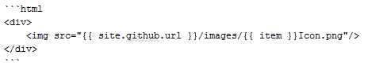
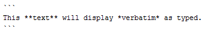



## Introduction
This section provides a summary of Markdown that you will frequently utilize. The 
Markdown format utilized is GFM or GitHub Flavored Markdown.

Please note that your Squirrel U content should *only* be utilizing Markdown as opposed to embedding other languages such as HTML. This
will help maintain styling and consistency throughout the site.

## Prerequisites

* None  

## Content Basics

### Italics

Use single asterisk (*) or underscore (_) characters around content which you would like to
render in italics. 

*Markdown:*

```markdown
*italics* or _italics_
```
 
*Renders into:*

>   *italics* or _italics_

### Bold
Use double asterisks (*) around content which you would like to render in bold.

*Markdown:*

```markdown
**bold**
``` 

*Renders into:*

> **bold**

### Links

You can include links in your documentation in two ways:

1. Display the address as an actionable link for the user to click on.

   *Markdown:* 
    
   ```markdown 
   <https://www.google.com> 
   ``` 
  
    *Renders into:*
    
    > <https://www.google.com>

2. Display a description that takes the user to an actionable link.

    *Markdown:*
    
   ```markdown 
   [Click here to go to Google](https://www.google.com) 
   ``` 

    *Renders into:*
    
    > [Click here to go to Google](https://www.google.com)

At this time, it is generally preferred that you avoid linking to other Squirrel U documents
as movement of content will make these references more brittle over time 
resulting in broken links.  

If you move a content module within Squirrel U via refactoring, make sure that
you check the references option and any referenced links will be adjusted.  

Links are relative to the basepath. You do not need to include this basepath in your links!

### Images

* Images must be in .png format (with lowercase "png" file extension)
* Images must be named with a title that summarizes the content (i.e. "GenericFlower.png", not "2016-06-06_15-31-47.png")
* In almost all cases, format images with centering and shadow by adding **{: .image}** after the image link (exceptions can
be discussed with the Pull Request approver on a case-by-case basis)

Include images in your file using the following syntax, where the path in 
parentheses ( ) is the relative location of the image (See **Image Path** below for more information on this).

*Markdown:*

```markdown
{: .image}
```

*Renders into:*  
{: .image}

**Image Path**

There are two ways of placing Markdown files which will influence how you specify your image paths.  Please make sure
that you understand this!  If you are creating new image directories, please review the **Project Structure** section for
more guidance on which of these structures to use.

1. **Directory** (i.e. *1_MyModule*) containing **index.md** file and **images** dir

    Use a direct reference:

    ```
    
    ```

2. **Named Markdown file** (ie *1_MyModule.md*) with peer **images** directory

    Use a parent directory reference,

    ```
    
    ```

### Emojis
You can insert [emojis](http://www.emoji-cheat-sheet.com/) by using the syntax:

```markdown
:emojiname:
```

**NOTE:**
If you are using an Emoji within an HTML "include" file into your Markdown files,
these will properly render in your local environment. However the latest
Enterprise GitHub version does not yet have the latest Gems incorporated. Emojis
will work if directly specified in a Markdown file. :smile:

## Structuring Content  
 
### Headers

Use an increasing number of hash characters (#) to create headers for each
logical section in organizing your content. 

*Markdown:*

```markdown
# Header 1
## Header 2
### Header 3
#### Header 4
##### Header 5
```

*Renders into:*

# Header 1  
{:.no_toc}  

## Header 2
{:.no_toc} 

### Header 3
{:.no_toc}  

#### Header 4
{:.no_toc}  

##### Header 5  
{:.no_toc}  

Headers are used to automatically generate a table of contents for each page. 
Five levels of headers are supported in Markdown. 

**Prudent Usage of Headers**

To keep a page's Table of Contents compact, please be careful in usage of headers. It is
recommended that you keep to no more than 3 headers deep.

**Excluding Headers from the Table of Contents**

To exclude a Header from being included in the TOC, place a **{:.no_toc}** tag 
after the header that you want excluded: 

```markdown
## Header 2
{:.no_toc} 
```

### Lists

**Unordered Lists**

Use an asterisk (*) character at the beginning of a line to create a bulleted list.
By using indentation, you can change bullet style.

NOTE: make sure that you put a blank line in between a sentence and a list to 
ensure that the list renders correctly.
  
*Markdown:*

```markdown
 * Item 1
 * Item 2
    * Item 2a
    * Item 2b
```

*Renders into:*

> * Item 1
> * Item 2
>    * Item 2a
>    * Item 2b

**Ordered Lists**

Use a numeric character followed by a period (.) at the beginning of lines to
create ordered lists.   Can combine with unordered lists.

NOTE: make sure that you put a blank line in between a sentence and a list to
ensure that the list renders correctly.

*Markdown:*

```markdown
1. Item 1
2. Item 2
    * Item 2a
    * Item 2b
```
*Renders into:*

>1. Item 1
2. Item 2  
    * Item 2a
    * Item 2b

### Tables

Use **pipe** characters (|) to separate columns, using a beginning and ending pipe.
Your first row is always a header row, preceded by a row of dashes (must be at 
least 3 dashes for each column), followed by your data rows.  You can align your 
columns for easier reading, but they don't have to be pretty in order to render.

If your table is too large to fit on the screen, add the **{: .largeTable}** tag to decrease font size.

*Markdown:  

```markdown
| Table | Header | Row  |
|-------|--------|------|
|Col 1  |Col 2   |Col 3 |
|Col 1a |Col 2a  |Col 3a|
```

*Renders into:*

| Table | Header | Row  |
|-------|--------|------|
|Col 1  |Col 2   |Col 3 |
|Col 1a |Col 2a  |Col 3a|

**Column Alignment**

You can also use colons (:)s to right-align or center columns.  

*Markdown:*

```markdown
| Table | Header   | Row       |
|-------|:--------:|----------:|
|Normal |Centered  |Right Align|
|Col 1  |Col 2     |Col 3      |
|Col 1a |Col 2a    |Col 3a     |
```

*Renders into:*

| Table | Header   | Row       |
|-------|:--------:|----------:|
|Normal |Centered  |Right Align|
|Col 1  |Col 2     |Col 3      |
|Col 1a |Col 2a    |Col 3a     |

## Sentences and Paragraphs  

**Line Width**

The site style depends on an 80 character line width for best presentation. If you are using IntelliJ to generate content,
it is recommended that you set the right margin as 81 and "Wrap on Typing"
by going to Preferences or Settings and then Editor->Code Style, Right margin 
(columns):

{: .image} 

### Whitespace and Line Breaks

While you may be used to using whitespace to indent and organize your 
documentation, you don't need to do that with Markdown. Utilize Headers and 
various emphasis tags to organize your content.  

Spaces are very important in processing many Markdown constructs. Usually you 
will need to prefix with 3 spaces. If you put too few in or too many, the 
Markdown will not be processed correctly.   

It is also important that you put line breaks between content text and Markdown 
constructs. If you see content jammed up to a Markdown rendering or Markdown not 
processing correctly, chances are that you need to add whitespace in the form of 
a Line Break. For example you'll need to include such empty lines before tables 
and lists. 

Enter a manual line break by ending a line with two or more spaces.  

### Block Quotes

Use a greater than sign (>) at the beginning of each line that you would like to 
be displayed in a block or box.

*Markdown:*

```markdown
Someone once said:

> One, two buckle my shoe  
> Three, four shut the door  
```

*Renders into:*

Someone once said:

> One, two buckle my shoe  
> Three, four shut the door  

### Coding Examples

In Squirrel U, you'll likely want to display HTML, JavaScript, JSON, Groovy, Java,
SQL and shell script code.

Utilize 3 backticks (`) to fence code blocks, specifying a language for formatting
style. Squirrel U utilizes an 80 character margin, so please ensure that your code
examples are well within this margin limit.

Make your code readable by keeping { contained on the same line as a function or conditional. Keep your
examples and comments short by simplifying the way you say things. Make your code
inherently readable by using descriptive variable and function names and using
accepted coding standards as described within Squirrel U.

HINT: Make sure that you start your fencing in the very first column!

**Examples**

Supported syntaxes include: HTML, JavaScript, Groovy, Java, JSON, XML, SQL, Shell
and many more.

**HTML**

*Markdown*



*Renders into:*

```html
<div>
    
</div>
```

**JavaScript**

*Markdown*


*Renders into:*

```javascript
(function() {
    jQuery(function() {
        var baseUrl = document.location.origin;
        ...
    });
}());
```

**Displaying a Code Snippet within a Sentence**

Use backtick ` characters around text you want to render as inline code.

_Markdown_   

```markdown 
Inline code sample: `code` 
``` 

_Renders into:_ 

Inline code sample: `code` 

### Escape Evaluation

To display code blocks or plain text that is not evaluated as Markdown, fence the text with 3 backtick (`) characters.

*Markdown:*



*Renders into:* 

```
This **text** will display *verbatim* as typed. 
```

## For Further Reading
* [Markdown](https://daringfireball.net/projects/markdown/syntax)
* <https://guides.github.com/features/mastering-markdown/>
* <https://help.github.com/articles/github-flavored-markdown/> 


