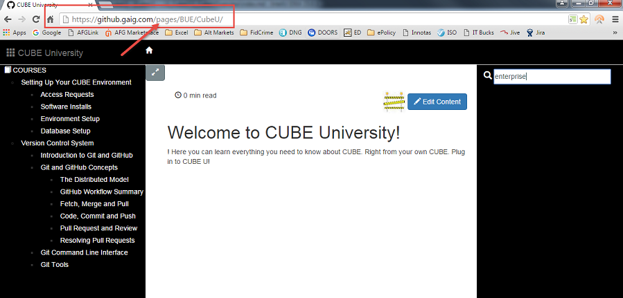
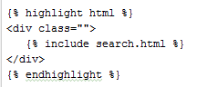



## Introduction
Lets take a closer look at the architecture for Cube U.

## Prerequisites

* None 

## GitHub
The Cube U project lives in a GitHub Enterprise repository called "CubeU" in the
BUE organization. This is the same source control repository CUBE uses for its
source code. This allows us to treat our knowledge content with the same care and
diligence that we do our code. This means that content will be version 
controlled; content will be stored in a central location and go through the same
review process that code goes through...And you can do all this disconnected from
the network.

Having a diligent review process means that content is reviewed for consistency,
accuracy, completeness, standards, etc. before it goes "live". This will allow
Cube U content to be more "authoritative" in nature. We want Cube U to be a place
where CUBE Developers can go to quickly find the information that they need to do
a quality job in CUBE...with the confidence that the information they are getting 
is accurate, complete and update-to-date.

## Markdown
Markdown, abbreviated as md, has been selected as the content medium for Cube U.
Markdown is a very simple markup language that provides the ability to write 
plain text content for web pages.  There are several different markdown 
processors; we are using kramdown, which is set in the _config.yml file.

At its core, Markdown is just a super simple way to add formatting like headers,
bold, bulleted lists and so on in plain text. Images are also supported to allow 
for screen shots, diagrams and other visual aids.
This helps keep documentation formatting clean and consistent.

Think of all of the various formatting you have seen in Word documents. It 
usually comes down to personal preference, familiarity with the tool, how much 
time was available to prepare a document and other factors that come into play 
when "styling" is a question. Markdown eliminates the guesswork for contributors 
because it will render content in a consistent manner using a standard syntax. 

More details on Markdown and how to create content using this format are provided
in the **Markdown Overview** page.

## GitHub Pages

GitHub offers an awesome feature called GitHub Pages, which are web pages hosted 
and published through the GitHub site. Each time there is a merge in the CubeU
repository ... gh-pages branch, the content is converted through Jekyll 
(more below). This provides a straight path for curated content placed into 
GitHub to be automatically built into a website served on GitHub Pages.

All we have to do is add "pages" to the Cube U GitHub URL and viola!...our content
is rendered right there.

Here we are at the top level directory of our Cube U repository...note the URL

{: .image} 

Simply add "pages" to the URL and the content is rendered in the browser

{: .image} 

The same concept exists for personal repositories as well, allowing users to view
their work rendered in the browser before submitting a
Pull Request to the BASE repository.

Note that this option has to be turned on for each repository by going to the 
settings icon on your Repo page.

## Jekyll


So you've heard of Jekyll and Hyde, where the careful Dr. Jekyll turns into the 
unruly Mr. Hyde. Jekyll takes a more carefully curated and easier-to-maintain 
set of content written in Markdown and Liquid templates and turns it into HTML, 
leaving the ugly details to Jekyll to handle. Jekyll is a simple, blog-aware, 
*static site generator* for personal, project, or organization sites.

Written in Ruby by Tom Preston-Werner, GitHub's co-founder, it is distributed 
under an open source license.

As you are probably starting to realize, the idea here is to generate static 
content from a file format that is easier to maintain than traditional HTML. 
In order to create these static web pages from dynamic components, 
GitHub uses this parsing engine called Jekyll.  Jekyll takes your project and 
parses it to create its own self-contained static _site folder. 

Once generated, these pages are served without any particular backend processing 
(no server, no database, etc.). It shifts the work from runtime to when the 
content actually changes, at which point it can be processed in bulk for the 
whole site.

As mentioned, one appealing element of this parsing engine is that it converts 
our Markdown files in to HTML.  This enables contributors to utilize the more 
user-friendly Markdown to create their content and Jekyll does the heavy lifting 
from there.

Also, because the site is being rendered from the static _site directory, that 
makes it *very* fast.  For example, each time Jekyll regenerates the _site 
directory, the dynamic searchable material is indexed.  So when you enter search 
criteria, you get a response of matching content almost immediately.

Currently GitHub Pages supports Jekyll 3+. <https://github.com/blog/2100-github-pages-now-faster-and-simpler-with-jekyll-3-0>.
 
 To see all Jekyll dependencies and versions: 
 <https://pages.github.com/versions/> 

## Rouge Syntax Highlighting
Jekyll uses Kramdown and Rouge for code highlighting. This allows us to specify a code syntax style within three backtick fencing.

This has been setup within Squirrel U using the rougify utility.

**Theme Selection**  
Rougify will build the styling for various presentation themes. Each theme 
provides styling for a variety of languages. 

**To see the themes provided**
 
```shell 
 $ rouge help style 
    ... 
     available themes: 
         base16, 
         base16.dark, 
         base16.monokai, 
         base16.monokai.light, 
         base16.solarized, 
         base16.solarized.dark, 
         colorful, 
         github, 
         molokai, 
         monokai, 
         monokai.sublime, 
         thankful_eyes 
``` 
Cube U is currently using the thankful_eyes theme.
 
**To build the styled theme**
 
```shell
 $ rougify style thankful_eyes >css/styles.css 
```

**To see the languages supported**
 
```shell   
$rougify style list 
 
 *  apache: configuration files for Apache web server 
 *  applescript: The AppleScript scripting language by Apple Inc. (http://developer.apple.com/applescript/) [aliases: applescript] 
 *  c: The C programming language 
 *  clojure: The Clojure programming language (clojure.org) [aliases: clj,cljs] 
 *  coffeescript: The Coffeescript programming language (coffeescript.org) [aliases: coffee,coffee-script]
 *  common_lisp: The Common Lisp variant of Lisp (common-lisp.net) [aliases: cl,common-lisp,elisp,emacs-lisp] *  
 *  conf: A generic lexer for configuration files [aliases: config,configuration] *  
 *  cpp: The C++ programming language [aliases: c++] *  
 *  csharp: a multi-paradigm language targeting .NET [aliases: c#,cs] *  
 *  css: Cascading Style Sheets, used to style web pages *  
 *  dart: The Dart programming language (dartlang.com) *  
 *  diff: Lexes unified diffs or patches [aliases: patch,udiff] *  
 *  elixir: Elixir language (elixir-lang.org) [aliases: elixir,exs] *  
 *  erb: Embedded ruby template files [aliases: eruby,rhtml] *  
 *  erlang: The Erlang programming language (erlang.org) [aliases: erl] *  
 *  factor: Factor, the practical stack language (factorcode.org) *  
 *  gherkin: A business-readable spec DSL ( github.com/cucumber/cucumber/wiki/Gherkin ) [aliases: cucumber,behat] *  
 *  glsl: The GLSL shader language *  
 *  go: The Go programming language (http://golang.org) [aliases: go,golang] *  
 *  groovy: The Groovy programming language (groovy.codehaus.org) *  
 *  haml: The Haml templating system for Ruby (haml.info) [aliases: HAML] *  
 *  handlebars: the Handlebars and Mustache templating languages [aliases: hbs,mustache] *  
 *  haskell: The Haskell programming language (haskell.org) [aliases: hs] *  
 *  html: HTML, the markup language of the web *  
 *  http: http requests and responses *  
 *  ini: the INI configuration format *  
 *  io: The IO programming language (http://iolanguage.com) *  
 *  java: The Java programming language (java.com) *  
 *  javascript: JavaScript, the browser scripting language [aliases: js] *  
 *  json: JavaScript Object Notation (json.org) *  
 *  json-doc: JavaScript Object Notation with extenstions for documentation *  
 *  liquid: Liquid is a templating engine for Ruby (liquidmarkup.org) *  
 *  literate_coffeescript: Literate coffeescript [aliases: litcoffee] *  
 *  literate_haskell: Literate haskell [aliases: lithaskell,lhaskell,lhs] *  
 *  llvm: The LLVM Compiler Infrastructure (http://llvm.org/) *  
 *  lua: Lua (http://www.lua.org) *  
 *  make: Makefile syntax [aliases: makefile,mf,gnumake,bsdmake] *  
 *  markdown: Markdown, a light-weight markup language for authors [aliases: md,mkd] *  
 *  matlab: Matlab [aliases: m] *  
 *  moonscript: Moonscript (http://www.moonscript.org) [aliases: moon] *  
 *  nginx: configuration files for the nginx web server (nginx.org) *  
 *  nim: The Nim programming language (http://nim-lang.org/) [aliases: nimrod] *  
 *  objective_c: an extension of C commonly used to write Apple software [aliases: objc] *  
 *  ocaml: Objective CAML (ocaml.org) *  
 *  perl: The Perl scripting language (perl.org) [aliases: pl] *  
 *  php: The PHP scripting language (php.net) [aliases: php,php3,php4,php5] *  
 *  plaintext: A boring lexer that doesn't highlight anything [aliases: text] *  
 *  powershell: powershell [aliases: posh] *  
 *  praat: The Praat scripting language (praat.org) *  
 *  prolog: The Prolog programming language (http://en.wikipedia.org/wiki/Prolog) [aliases: prolog] *  
 *  properties: .properties config files for Java *  
 *  puppet: The Puppet configuration management language (puppetlabs.org) [aliases: pp] *  
 *  python: The Python programming language (python.org) [aliases: py] *  
 *  qml: QML, a UI markup language [aliases: qml] *  
 *  r: The R statistics language (r-project.org) [aliases: r,R,s,S] *  
 *  racket: Racket is a Lisp descended from Scheme (racket-lang.org) *  
 *  ruby: The Ruby programming language (ruby-lang.org) [aliases: rb] *  
 *  rust: The Rust programming language (rust-lang.org) [aliases: rs] *  
 *  sass: The Sass stylesheet language language (sass-lang.com) *  
 *  scala: The Scala programming language (scala-lang.org) [aliases: scala] *  
 *  scheme: The Scheme variant of Lisp *  
 *  scss: SCSS stylesheets (sass-lang.com) *  
 *  sed: sed, the ultimate stream editor *  
 *  shell: Various shell languages, including sh and bash [aliases: bash,zsh,ksh,sh] *  
 *  slim: The Slim template language *  
 *  smalltalk: The Smalltalk programming language [aliases: st,squeak] *  
 *  sml: Standard ML [aliases: ml] *  
 *  sql: Structured Query Language, for relational databases *  
 *  swift: Multi paradigm, compiled programming language developed by Apple for iOS and OS X development. (developer.apple.com/swift) *  
 *  tcl: The Tool Command Language (tcl.tk) *  
 *  tex: The TeX typesetting system [aliases: TeX,LaTeX,latex] *  
 *  toml: the TOML configuration format (https://github.com/mojombo/toml) *  
 *  tulip: The tulip programming language http://github.com/jneen/tulip [aliases: tlp] *  
 *  vb: Visual Basic [aliases: visualbasic] *  
 *  viml: VimL, the scripting language for the Vim editor (vim.org) [aliases: vim,vimscript,ex] *  
 *  xml: <desc for="this-lexer">XML</desc> *  
 *  yaml: Yaml Ain't Markup Language (yaml.org) [aliases: yml] 
 
```
 
## Front Matter

Jekyll breaks a page up into a few sections, including Front Matter and Content.

At the beginning of each Markdown file, Jekyll looks for the presence of Front 
Matter. The term "Front Matter" comes from the idea of all the material that 
comes at the "front" of a publication. For any md file to be processed,
it must have Front Matter.  Think of Front Matter as metadata describing the page
and contents.

We also are leveraging Front Matter to improve indexing of content for search. 
Front Matter such as title, author and tags are being used to create these 
indexes. 

You can find more information about Front Matter in the **Front Matter Overview** page.

## Liquid

Liquid is a templating language that uses tags, objects and filters to load 
dynamic content.  We are using Liquid to include dynamic content within the 
Content section of our md files as well as to build most other sections of 
the UI.

Example:

 

For example, you may have noticed that every page in Cube U has a **Contents**
section at the top.  This list is generated dynamically using a Liquid 
"includes" statement (similar to the one above, but referring to the 
toc.html) which links it to an external HTML file (written with Liquid) 
within an _includes directory. Each time Jekyll regenerates, it will build and 
generate a static HTML file using that Liquid template.

When starting your local Jekyll server, Jekyll will scan your directory structure
and parse each file for Liquid commands. Any Liquid processing performed has an
impact on startup time. However once processed this will not impact your update
time nearly as much because the hierarchy rebuild step in a local environment is
not performed until your next restart.

As such there are certain modifications which will require a server restart,
namely any changes that you make that affect the content hierarchy. So if you've
added or moved content in the hierarchy, you will need to restart the server. If
you're modifying existing content, you will not need to restart.

You can see the impact of Liquid processing on startup time by looking in the
Jekyll server startup output as profiling is turned on. You can see how long a
step has taken and the number of files that it has processed in doing so.

Cube U utilizes Liquid in a number of ways:

 * Building the Breadcrumb trail
 * Building the content hierarchy
 * Building the Search index

## Lunr Search

We are using a plugin called Lunr to implement the search functionality. 
The only issue is that plugins don't run on Jekyll, so the results file has to 
be pushed to the gh-pages branch. 

On the user interface, there is a search box which handles displaying the prompt,
input box, form submission and display of results. The template for this portion 
of the site is located in (/_includes/search.html).  This HTML file references 
all of the external files needed for the functionality of the search.  
These files include lunr.min.js (the search engine), jquery.min.js and search.js 
(search box functionality and search parameters, based on jQuery).

Much like several other components of the site's UI, the search feature is 
contained in its own file and inserted into the main site template, 
(/_layouts/default.html) using the Liquid templating langauge. 

## Bootstrap and Custom Styling

Wherever possible, styling is being applied to Cube U using the Bootstrap
library.  Customized styling is avoided in lieu of a Bootstrap solution, however 
there will always be a need to either alter Bootstrap styling or create new 
styling completely.

## JavaScript
Some JavaScript is used within the Cube U framework, namely a few standard
libraries such as Bootstrap, jQuery and Lunr. 

## Additions
The following additions have helped to advance Cube U functionality:

 1. For better layout:  Bootstrap
 2. For left hand nav: [Data Driven Navigation](http://www.tournemille.com/blog/How-to-create-data-driven-navigation-in-Jekyll/)
 3. For Breadcrumbs:  [Automatic Breadcrumb for Jekyll on Git Hub Pages](http://blog.comsysto.com/2015/04/25/automatic-breadcrumb-for-jekyll-on-github-pages/)
 4. For Breadcrumb styling:  [CSS Styling](https://css-tricks.com/triangle-breadcrumbs/)
 4. [Search](6_SiteSearch)
 5. For content driven nav: [Possibly ...](http://thinkshout.com/blog/2014/12/creating-dynamic-menus-in-jekyll/)
 6. Remove large amounts of whitespace in generated html: [Compression](http://jch.penibelst.de/)
 7. [Time to Read](https://sojourner.co/blog/code/time-to-read-post-jekyll.html)
    [another way to calc](https://medium.com/the-story/read-time-and-you-bc2048ab620c#.97kcp57u0)
 8. Fixed length (responsive) columns:  <http://alt-web.com/TUTORIALS/?id=equal_height_columns_bootstrap>
 9. Collapsible panels:  <http://stackoverflow.com/questions/27827888/bootstrap-show-left-column-and-toggle-button-on-small-devices-only>
 10. Formatting images: <http://thornelabs.net/2014/11/30/centering-images-with-jekyll-and-markdown.html>
11. Compressing/Minification: http://jch.penibelst.de/ 

## For Further Reading

* <http://jekyllrb.com/>
* <https://daringfireball.net/projects/markdown/syntax>
* <https://docs.shopify.com/themes/liquid-documentation/basics>
* <http://liquidmarkup.org/>
* <http://dreamand.me/web/fulltext-search-at-jekyll-site/> 
* <https://en.wikipedia.org/wiki/Jekyll_(software)>
* <https://github.com/Shopify/liquid/wiki/Liquid-for-Designers>
* <http://jekyllrb.com/docs/github-pages/>
* <http://kramdown.gettalong.org/converter/html.html>
* <https://github.com/jneen/rouge>
* [Newspaper Publishing Metaphor](https://davidwalsh.name/introduction-static-site-generators)
* [Princeton Academics used GitHub to create a 600 page book in 6 months.](http://www.wired.com/2013/06/cades-witty-headline-here/).