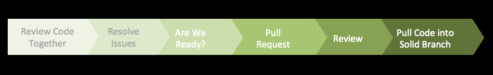



## Introduction

This section will introduce you to Git and GitHub, what they are and why Squirrel Works is investing in
them.

## Prerequisites

* None

## What is Git?

{: .right}

Git is a very powerful distributed Version Control System. It is a modern VCS being utilized
for technical and non-technical projects in a very distributed way across many organizations.
Git provides the architecture and concepts.

## What is GitHub?

GitHub is a web based layer on top of Git which provides a more streamline interface
for viewing Repositories, modifying and managing Repository content and collaborating
with other developers.  GitHub is a powerful tool with many key functions built in
for easy use.

{: .left}

Squirrel Works has purchased the GitHub Enterprise Edition (v2.4), which is hosted
in the Squirrel Works data center. This provides additional security and flexibility
in utilizing GitHub. With the exception of a few source code repositories, most
Squirrel related modules have been moved into this edition of GitHub and other Squirrel Works
assets will soon be migrated as well.

**Github Trivia**

> Simon Oxley designed the octopuss, alongside the white bird Twitter used
> (before they received a proper logo) as part of a usual routine of creating images for iStock.
> GitHub saw it, and wanted it, presumably under the notion that it can represent how complex code
> combines to create peculiar things, much like the octopuss...
> except the CEO of GitHub called it an octocat, and it has been the octocat ever since.
> Check out all of octocat's personas in the [GitHub Octodex](https://octodex.github.com/).

## Why Git and GitHub?

**Old School Tools Influence Culture**

In the past, we have been hampered by practices and systems that discouraged communication and
sharing and increased our chances for bad builds entering our release chain.

Many of us "grew up" in development environments built upon centralized revision control,
which discouraged early code review and learning opportunity. Many of us can relate to this
statement:

> “When I started in computer science, there wasn't a whole lot of collaboration,
> there wasn't a whole lot of teamwork. You worked by yourself. You didn't talk to
> anybody.” - Mark Tareshawty

Such a revision control system (CVS) promoted:

 * independent development and check-in
 * late reviews (via sharing packages or FishEye) often post check-in
 * coarse check-ins, difficult to branch and recover

To some extent the tools used discouraged practices needed for a large software initiative, and thus
promoted the move to Git / GitHub.
   
Unlike CVS, which was created in 1986 and hasn't been actively released since 2008, 
Git is a modern version control system, originating in 2005 and is actively maintained.  
 
**The major benefits of Git / GitHub include:**  

### Ease of Use
   * lightweight branching and merging
   * fast: due to most operations performed locally (no server required for local development)
    
### Data Integrity
   * distributed - each user has full backup of main server 
   * data assurance - ensures cryptographic integrity of every bit of your project
    
### Flexibility 
   * can use without connectivity
   * flexible workflow (adapt with expertise and need)
   * solid support for storing non-binary and large binary content
  
### Tooling 
   * strong collaboration tools for sharing, reviewing and amending work  
   * tools such as Jekyll and GitHub Pages for sharing content

**Growing Pains**
Squirrel Works is growing by leaps and bounds.

The code base has grown in complexity and continues to evolve in form.  
The organizations consuming Squirrel Works continues to expand.
The number of teams continue to grow from 3 to 9 (or more).
The total number of developers has reached 65 (or more).  

As the customers, teams, developers and code base have increased in size,
there has been greater incidence of a broken development environment.

Impacting factors include:  

 * increased commits to stable DEV that break builds  (particularly at end of sprints) 
 * ad-hoc communication of change via email, or Squirrels to Squirrels  
 * difficult recovery as were rollbacks difficult

By utilizing these Git features, many of these challenges will be mitigated:  

  * Git Pull Request:  earlier, required review prior to code check-in
  * GitHub Collaboration:  built right into workflow will encourage open communication  
  * Git branching: branch manipulation will make recovery much easier
  
There still issues that need to be addressed including how we've packaged our software,  
the multitude of other systems in our architecture and the coupling between source code
and models in n-Squirrel.

However, these features will go a long way in improving stability of Squirrel development.
  
### Better Asset Maintenance
We plan on utilizing Git/GitHub for software source assets, including:  

   * HTML, CSS
   * JavaScript [Bootstrap, Angular, jQuery]
   * Groovy
   * Java
   * XML
   * Any non-n-Squirrel JSON files (n-Squirrel specification data formerly in JSON files is moving to storage in the n-Squirrel database)
   * Database DDL scripts
   * Code supporting any support tools (Hudson, Jenkins, etc)
   
We are also going to use it for publishing our Squirrel knowledge base, including Squirrel University
and related documents supporting software development (i.e. setup, design, testing).

## CVS vs. Git Comparisons

### Workflow

CVS:

{: .image}

* Worflow seems backwards
* Simple Workflow: updates/commits with Central Repository
* No review / collaboration capability
* Branching, merging & rollbacks painful

GitHub:

{: .image}

* Forwards workflow
* No specified Workflow Model - up to us
* Can achieve review / collaboration
* Branching, merging & rollbacks much easier!!

### Concepts

|Concept	                | Centralized (CVS)	            |Distributed (GitHub)	        | Consequences
|------------------------|-------------------------------|-------------------------------|-------------------------
|Asset Identity	        | file name & contents	        | SHA-1 keys for asset, commits	| Git: Unique key anywhere
|Change management	    | Stores differences	        | Stores exact copy	            | Git: Very portable
|Branch management	    | File based	                | Point to SHA-1 key	        | Git: makes switching branches very easy
|Review / Communicate	| Resort to Fisheye, email	    | Pull Request, Tasks, Issues	| True team based workflow from the start!

### Operations

|Operation                                   |	CVS	    | Git
|--------------------------------------------|-----------|-----------------------------
|Initial retrieval	                        | checkout	| checkout / clone / fetch
|Create branch	                            | n/a    	| checkout -b name
|Put in control of VCS                       |	add	    | add
|Put change in staging area	                | n/a	    | add
|Put change in local repository (snapshot)	| n/a	    | commit
|Pull in remote changes	                    | update	| fetch
|Push changes to remote repository	        | commit	| push
|Submit for review	                        | n/a	| pull request

### Commands

|Command	 | Meaning in CVS                           |	Meaning in Git
|---------|---------------                           |----------------------
|fetch	 | n/a	                                    | (clone) Initial retrieval, Pull in remote changes
|checkout |	Initial retrieval	                    | Make branch active
|update	 | Refresh from central repository          |	n/a
|branch	 | n/a here	                                | setup separate logical area for feature work
|fork	 | create separate repo	                    | create copy of existing project
|add	     | Put in control of VCS	                | Put change in staging area
|commit	 | Checkin changes to central repository	| Put change in local repository snapshot
|push	 | n/a	                                    | Push to remote repository
|pull request    |	n/a	                            | Submit for review
|merge	| Join non-conflicting changes	            | Join non-conflicting changes
|rebase	| n/a	                                    | Stack changes (rearrange history)

## For Further Reading

* [Git History](https://en.wikipedia.org/wiki/Git_\(software\))  
* [Git Features](http://www.git-scm.com/about)
* [GitHub Enterprise](https://enterprise.github.com/features)