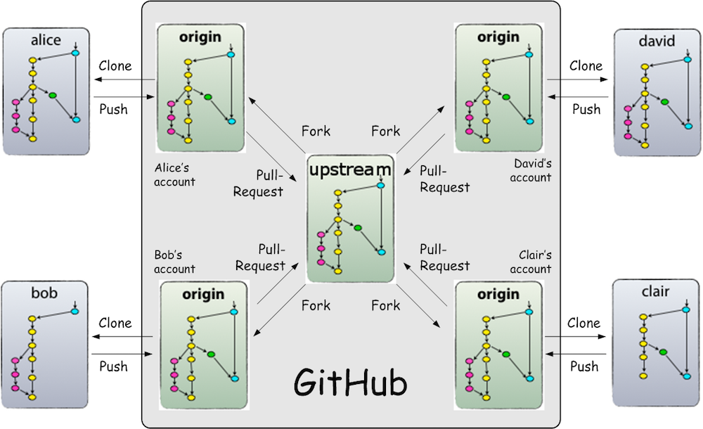



## Introduction

This section provides an overview of the Distributed Model as enabled by Git and facilitated by GitHub.  A glossary of
the GitHub icons is also included. Each concept is also explained in more detail in its own section.

## Prerequisites

* None

## Distributed Model

{: .image}

To develop in an open source project hosted on GitHub, a developer forks the canonical project repository to their own
GitHub account, then clones the fork to their local system for development and testing. According to common Git
convention, the fork is called “origin” (because it is the origin of your local development repo), and the canonical
project repository is called “upstream” (because it is upstream from “origin”).

After completing a set of changes, a developer pushes their changes to origin (so their origin repo now includes their
changes), then sends a Pull Request to the project maintainers to pull their changes upstream. A project maintainer
reviews the changes in the Pull Request, pulls accepted changes into their own local clone of the canonical project
repository, and finally pushes the result back to the canonical repository (yes, I said the changes are finally pushed
to the canonical repository but the process from the developer’s perspective ended with the pull).

Sometimes a group of developers will collaborate on a new feature, pulling changes from each others origin repos, before
sending a Pull Request for their collective result. This prevents premature work from being committed to the canonical
repository. Pulling from other developers is simplified by defining a “remote” in your local repository for each of the
origin repositories of the other developers working with you.

Courtesy [Using Gitflow with the GitHub Fork & Pull Model](http://www.dalescott.net/2012/09/14/using-gitflow-with-githubs-fork-pull-model/)

## GitHub Workflow Icons

| :--------------------------------------------------- :| : ----------------- : |
|| Repository|
|| Fork |
|| Clone|
|| Commit |
|| Push |
|| Force Push|
|| Pull Request |
|| Compare |
|| Comment |
|| Merge |
|| Branch |
|| Pull |
|| Tag |
{: .GitHubIcons}

## For Further Reading

* Links