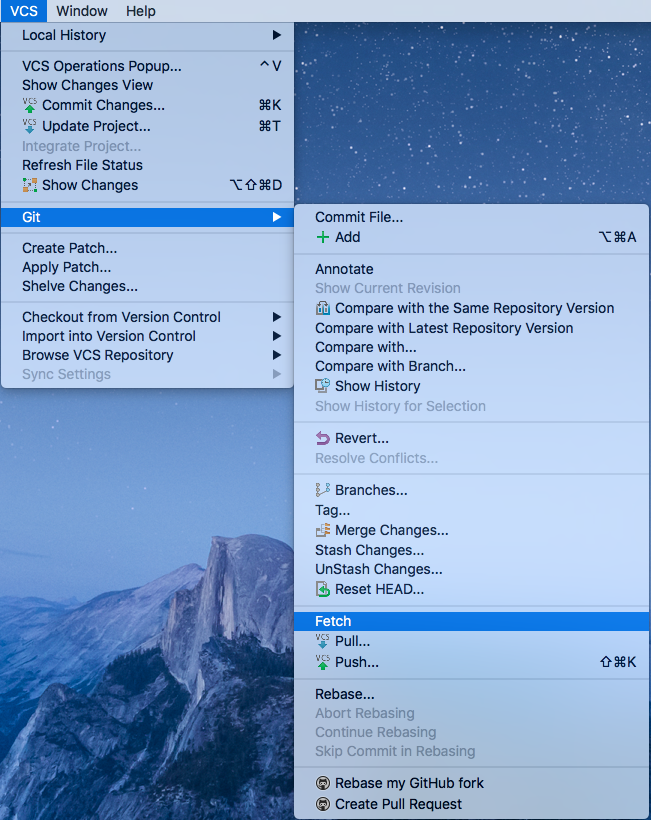
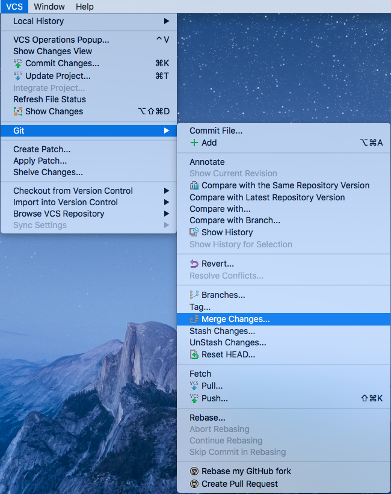
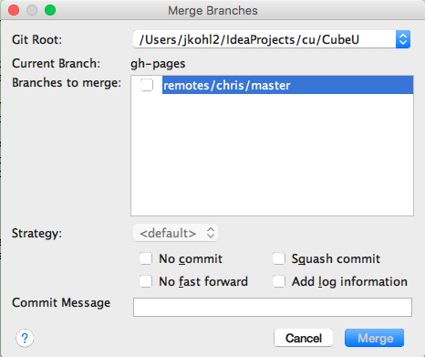
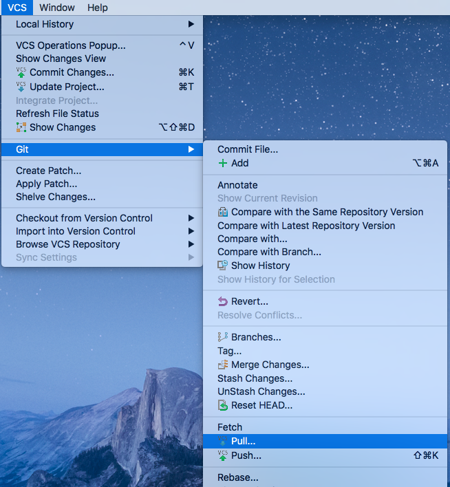
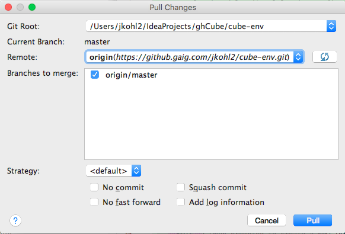
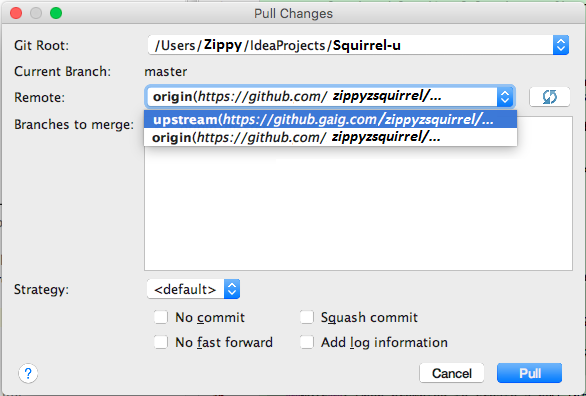
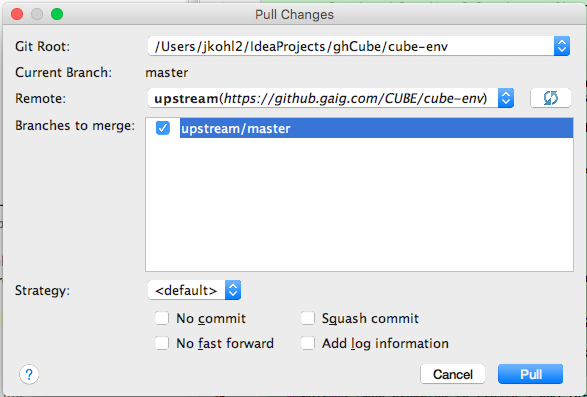
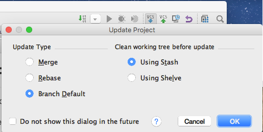



## Introduction

If you do not keep current with upstream, it will be more difficult to push your committed changes to the BASE repository  
as your master's head and upstream master's head will not match.   

You can use one of these methods to consume these changes:  

* Fetch, then Merge
* Pull
* Update Project

This section covers how to keep your cloned repository up-to-date with the BASE repository.

## Prerequisites

*  You should first have your Squirrel environment setup in IntelliJ.  See [Setup Squirrel Projects from Git]({{ site.github.url }}3_Development/1_Setup/1_Squirrel/3_environmentSetup/1_setupProjects) for assistance.

## Fetch then Merge <span class="octicon octicon-git-merge" style="font-size: 20px"></span>

This two step strategy provides more control over what changes you will allow into your active branch.

1. Navigate to **VCS** > **Git** > **Fetch**
 
    {: .image}

2. Navigate to **VCS** > **Git** > **Merge Changes**

    {: .image}  

3. Any branches that need to be merged will be displayed; choose the branch(es) to merge to the current local branch

    Select the **Strategy** and settings using the dialog box controls; **default** is recommended

    {: .image}

4. Click **Merge** to begin the merge.  If your master is ahead or behind the upstream master and you do a merge, Git will attempt to resolve non-conflicting 
differences.  If successful, there is no more to do.  If unsuccessful, you'll need to take action.

TODO: MM "you'll need to take action" this leaves the reader wondering what to do...need reference to "fixing merge conflicts" or something

Merge strategies (default, resolve, recursive, octopus, ours, subtree) are not a trivial subject.  The merge strategies that you specify 
for Pull also are used when you attempt to do a Push.If you'd like to learn more, there are links at the end of this section.  

## Pull <span class="octicon octicon-repo-pull" style="font-size: 20px"></span>

If you prefer one step, use Pull to bring down changes from upstream; this performs a fetch and merge.  

1. Navigate to **VCS** > **Git** > **Pull**
    
    {: .image} 

2. You will then be prompted with Pull options  

    {: .image}  

    **Note: Originally, you will be presented with the origin branch.  This is not the one you want!  Remember, always Pull from Upstream.**  

    {: .image}  

3. Select the upstream branch as your Remote and make sure that you check the branch which you want to merge  

    {: .image} 

## Which approach should I use?

It really depends on the degree of control which you want to exercise when consuming Upstream changes.  If you want to 
selectively take in changes, definitely use Fetch and Merge.  

However, given that we are consuming source AND Squirrel content from many teams, it will likely be to your advantage 
to consume these changes as a whole package to stay current.  Hence the preference for Squirrel to utilize Pull.  

## IntelliJ's "Update Project" 
There is an "Update Project" button in IntelliJ, which basically does a Pull and gives you the choice of merge vs rebase.
  
{: .image}

### Update Type
This specifies the strategy for synchronizing your local repository with remote storage and how to clean locally.
When you set these options, you are setting them for all Git version control roots.

**Merge**

Will perform a merge of upstream branches into your local branch, which is equivalent to:

```js
git fetch ; git merge 
or 
git pull --no-rebase 
```

**Rebase**

This will rewrite the order of various commits, which is equivalent to:

```js
git fetch ; git rebase 
or 
git pull --rebase
```

TODO: MM I don't really understand this...can we add more details?

**Branch Default**

This option will use the default command that has been setup in the branch.name section of the .git/config file,
basically overriding the global setting.

### Clean working tree before update

Prior to an update, you can specify how GitHub should clean your working tree (directory) in an effort to avoid a conflict.  
IntelliJ will stow your changes prior to the update and restore them afterwards.

You can use either Stash (a GitHub concept) or Shelve (IntelliJ concept).  The primary difference between these is who generates 
the patches, Git or IntelliJ, and therefore where these patches can be applied.

**Using Stash**

This will utilize Git's stash facility; you can manage this like a stack and make its contents available onto your current branch 
using Git commands.  

**Using Shelve**

This will put your local changes into a patch group on a shelf and then unshelf them using the IntelliJ interface.
IntelliJ uses the terminology of unshelved (applied or active or pending changelist) and shelved (not applied or inactive)

## For Further Reading

* [Git Merge Strategies man pages](https://www.kernel.org/pub/software/scm/git/docs/git-merge.html)
* [Git Merge Strategies discussion](http://stackoverflow.com/questions/366860/when-would-you-use-the-different-git-merge-strategies)