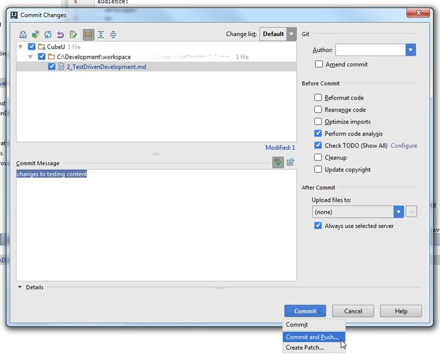



## Introduction

This section will walk you through changing your code and committing and pushing these changes. 

Most of the steps in this section will be performed in IntelliJ, with verification 
at the GAIG GitHub website.

## Prerequisites

* Before executing a Commit or Push activity, you should first have your Squirrel environment setup in IntelliJ.  See [Setup Squirrel Projects from Git]({{ site.github.url }}3_Development/1_Setup/1_Squirrel/3_environmentSetup/1_setupProjects) for assistance.  

## Code (and Stage)  
As you modify individual files, they are auto-saved in IntelliJ by default (unless you've disabled that capability).   

If you've turned on silent add of files, new files will be automatically added to your staging area and local tree.
 
Because of this, changes will appear in Version Control and are ready to be committed; you won't have to add these 
files from a Git standpoint.  

## Commit  

At some point, you will complete a specific coding activity and will wish to commit it into your master (or other) branch.
Remember that when you commit a file in Git, you are not affecting any repositories housed in GitHub, you are only committing 
the changes you've made to your .git director on you local machine.  Note that you do not explicitly have to execute this step
if you want to send your changes directly to your public GitHub repository.  See **Push** below for more information. 

To commit changes in IntelliJ, simply right click the file in the Project directory and select **Git** > **Commit File**.  

{: .image}

Or, in **Version Control** > **Local Changes**, right click on **Default** (to commit all files) or select one or more specific 
files and select **Commit Changes**. 

{: .image}

You will be presented with a commit window.  Review the files selected to be committed and verify, add a commit message 
and select **Commit** when you are ready.  Your selected changes will then be committed to your local .git directory. 

{: .image}

Then you can begin working on other features or sections of your code and accumulate a series of commits. 

## Push  

As you make your commits, you may also want to make your changes available on your public GitHub repository (aka. more 
broadly available for review).  This is accomplished by executing a Push.

You can either Commit and Push files in one step or you can Push at a separate time from when you Commit.  

To Commit and Push in a single step, select the files you want to Push as outlined above, hover on the **Commit** button 
and then select **Commit and Push**.
   
{: .image}

You'll then be prompted with a **Push Commits** window.  Make sure that you are pushing to **origin**, not **upstream** 
(remember origin is for pushing, upstream is for getting updates). 

Once you are ready, click **Push** to promote your changes to your public fork.

{: .image}

Once you are ready, click **Push** to promote your changes to your public fork.  

Note that if you press **Cancel** instead of **Push**, your changes will be committed only to your local branch.  You will 
still have the opportunity to push these changes up to your public fork at your next Commit and Push or by choosing to Push
from the VCS menu.  

In the event that you have one or more Commits that you would like to Push to your public GitHub repository, select **VCS** >
**Git** > **Push**

{: .image}

A **Push Commits** window will be presente with a list of all of your "unpushed" Commits.  Click **Push** when you are ready. 

{: .image}

If there were no issues (merge issues, etc.), you should see a **Push successful** message appear. 

{: .image}

## Force Push 
  
If you've make a commit by mistake and it hasn't been pushed to a remote repository, 
you have some options to resolve such as: git commit --amend, rebase, reset and others.
    
However, if these changes *have* been pushed, you will need to Force-Push to change 
your git history.  This is a dangerous solution in a shared repository, however it 
may be necessary. This option is available with committing/pushing, however it is 
recommended that you do not use it.

Note that if you do not have an Approver role, you will receive an error when
attempting a Force-Push.

## For Further Reading

* [Force Push](http://blog.sensible.io/2012/10/09/git-to-force-put-or-not-to-force-push.html)