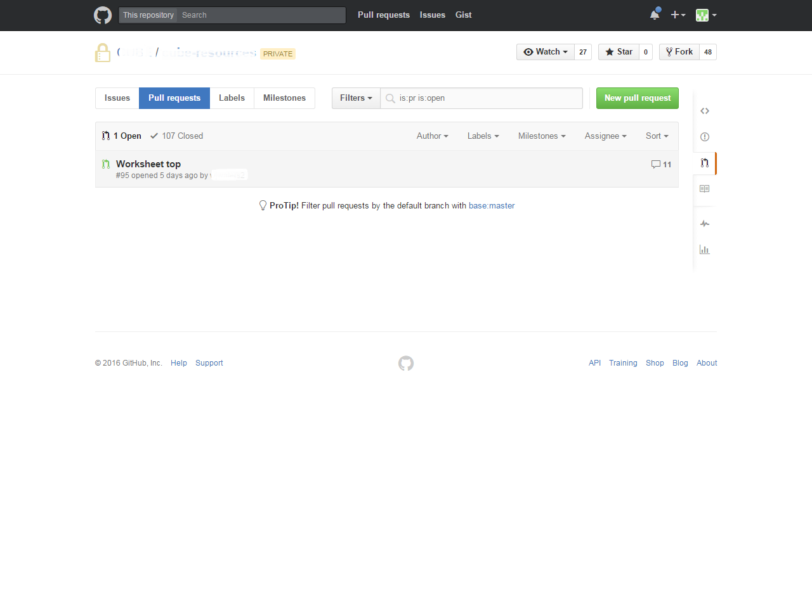
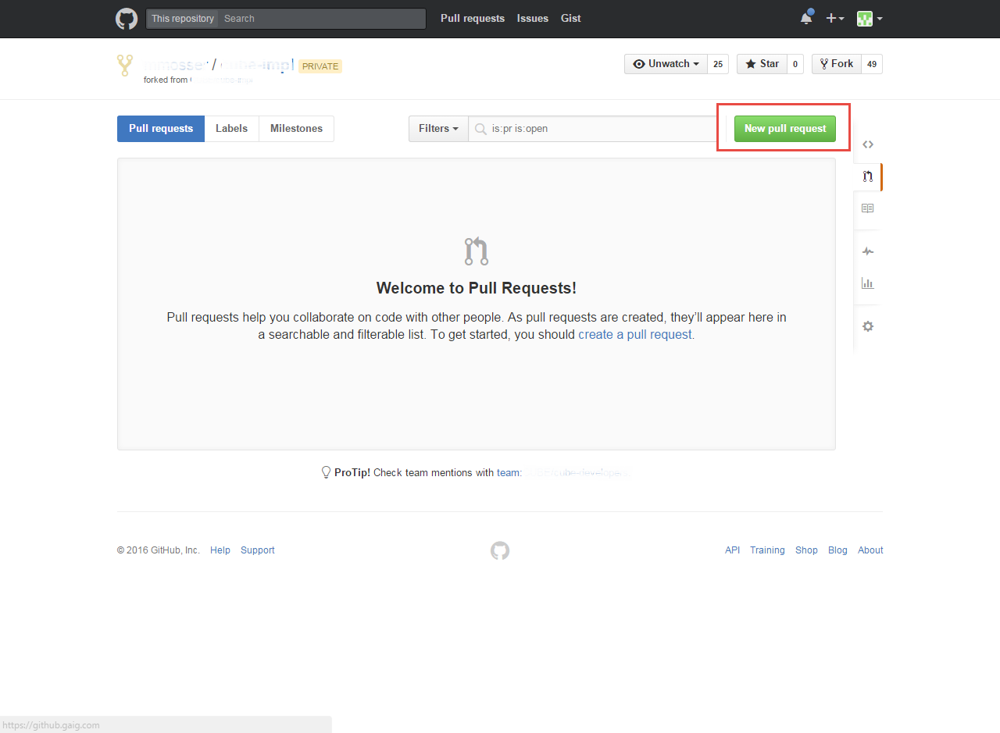
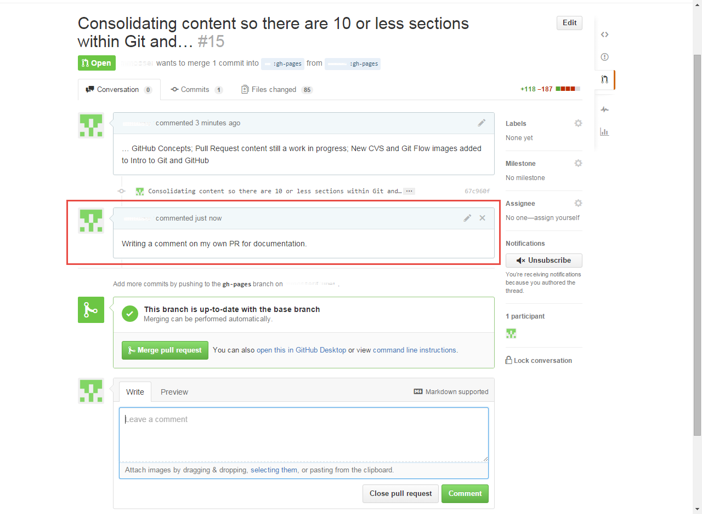
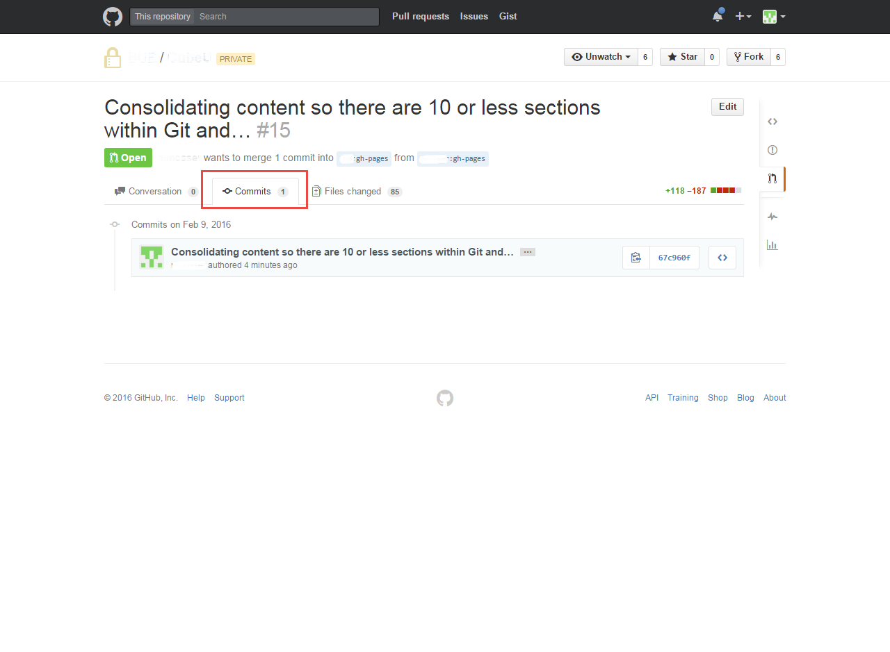



## Introduction

In GitHub, code can be shared early and often with a team.   

Pull Requests eliminate the need to email code patches, check your code into
master branches of our GitHub Repositories or use FishEye.

The Pull Request terminology comes from the idea that you are requesting someone
else to "pull" your requested package into the BASE repository.
 
After you create a Pull Request, reviewers can:   

  * Review and comment on your code (using Markdown)  
  * Merge your Pull Request into their local GitHub repository and test
  * Review and merge into the BASE repository (if they have an Approver role) 

This section covers how to share your work for review with your team in GitHub
via the Pull Request.
  
## Prerequisites

* Before completing a Pull Request, you first need to have pushed your code to
your public GitHub repository.  See [Code, Commit and Push]({{ site.github.url }}/3_Development/2_VersionControlSystem/2_basicConcepts/4_CodeCommitPush/) for assistance.

## Viewing Pull Requests

1. Navigate to GAIG's GitHub URL <https://github.gaig.com/Squirrel> and login

2. Select the repository for which you would like to view Pull Requests

    {: .image}

3. Click **Pull requests** in the right sidebar (you can see that there is 1 Pull
Request open from this screen)

    {: .image}

4. A list of Pull Requests will be available (if any exist), which can be filtered
on several criteria

    {: .image}
    
5. Click on the Pull Request title to see the Pull Request details

## Create a Pull Request 

**In GitHub**

1. Navigate to your public repository against which you would like to issue a Pull
Request and click **Pull requests** in the right sidebar

    {: .image}
    
2. Click the green **New pull request** button

    {: .image}

3. Here you can view all of the changes to your public repository as compared to
the BASE repository; click **Create pull request**

    {: .image}
    
4. Title your Pull Request and add your comment; click **Create pull request**
when you are ready

    {: .image}
    
**In IntelliJ**

Rather than going to the Enterprise GitHub site to create a Pull Request, you can
do it directly in IntelliJ.

1. When you are ready to create a Pull Request (after Pushing changes to your
public GitHub repository), navigate to **VCS** > **Git** > **Create Pull Request**
    {: .image}  

2. **Create Pull Request** window will appear.  

    * **Base fork:** - The Repository that you want the Pull Request to be merged into
    * **Base branch:** - The branch of the Repository you want the Pull Request to be merged into (probably "master")  
    * **Title:** and **Description:** - Add a meaningful comment and description, as IntelliJ does not transfer any information from a recent Push or Commit  
    
    {: .image}

    If you want to initiate a Pull Request to someone's fork instead of the base repository, you can do so by selecting **Select Other Fork** 
     and choosing the username of the person whose fork you want to initiate a Pull Request against  
     
    {: .image}

3. You will be prompted that the **Target Branch Is Not Fully Merged**; click **Yes**
  
    {: .image}  

4. An alert will appear in the top-right corner of IntelliJ (if you have the VCS Watch plugin), letting you know that a Pull Request 
has been created.  Clicking the link in the alert will take to you to the GitHub web interface to view the Pull Request
  
    {: .image}  

## Comparing a Pull Request 

TODO need detail here

## Commenting on a Pull Request 

### General Comments
  
1. To create a general comment for a Pull Request, simply navigate to the Pull Request in question

    {: .image}

2. Then add a comment in the available comment box and click **Comment**

    {: .image}

3. Your comment will then be added to the Pull Request Conversation

    {: .image}

### Line Item Comments

You can also add comments to specific lines of code within the Pull Request

1. Navigate to the **Files changed** tab within the Pull Request

    {: .image}

2. Find the line item in question.  As you hover over the line, a **+** sign will appear; click the **+** and add your comment 
to the comment box and click **Comment**

    {: .image}

3. Your line item comment will also be added to the Pull Request Conversation

    {: .image}

## Adding Reviewers with @mention
If there are additional developers or Approvers that you would like to draw into
the conversation or Pull Request review, you can use the @mention feature.
Simply type @ plus the username of the person you want to notify.

{: .image}

That person will then be notified via email that they have been mentioned in a comment or Pull Request

{: .image}

That person will be involved in all activity on the Pull Request from that point on, unless they choose to shut off notifications.

## Modifying a Pull Request
 
**Modify Directly in GitHub**
You can directly make a change to a file in the Pull Request.  If you modify a file, then you will either put it back into 
your master (stays with PR) or create a new branch (requires a new Pull Request). 

{: .image}

TODO: MM Need more details and screenshots

**Modify with Additional Pushes**

Any Pushes to your public GitHub repository against which you have an open Pull Request, will automatically be added to the 
open Pull Request.

Notice that in the Pull Request below, there is one commit.

{: .image}

In IntelliJ, we made an additional change to a file and Pushed it to the repository.  You can see below that this change was 
automatically added to the Pull Request that was open and now there are two commits included.

{: .image}

## Pull Request Builder

The Pull Request Builder is used to validate your pull requests before they are merged to master. Jenkins can build your pull request 
before it’s merged, to verify that it works.  This process can only be useful if we keep our build times fast and prioritize 
code reviews.  A pull request that sits too long or is merged out of order can create extra work for developers.

**How do I configure it?**

On your Jenkins job configuration, check **GitHub Pull Request Builder**. Under **List of organizations. Their members will 
be whitelisted**, add your git organization.  For example “BUE.”

TODO: MM I don't understand where this is.  Can we get a screenshot

**How do I use it?**

In GitHub, open the pull request and make a comment “Jenkins, please test this.”  

{: .image}

Jenkins will eventually see the comment, grab the pull request, build it and update the pull request status with the results.
  
{: .image}

If it fails, you can make changes, then do it again. Here is the Jenkins build log with the pull request at the top.  It 
will link back to the GitHub UI.  The Pull Request Builder should only run in CI, not Official, here is a link to it: <https://cidev.admin.gaic.com> 

{: .image}

**How will the queuing order work?**

First in, first out. If there are 3 Pull Requests Builder requests, Jenkins will build them in 
the order they are requested.  They will not stack code.  This means Pull Request 2 and 
Pull Request 3 will be built against master (HEAD) and not against each other.  The 
most accurate way to test your Pull Request is after you’ve merged the pull requests 
before it.  Additionally, if the build time is 17 minutes, then you can expect to wait 
34 minutes before the third pull request will start.

## For Further Reading
  
* Links