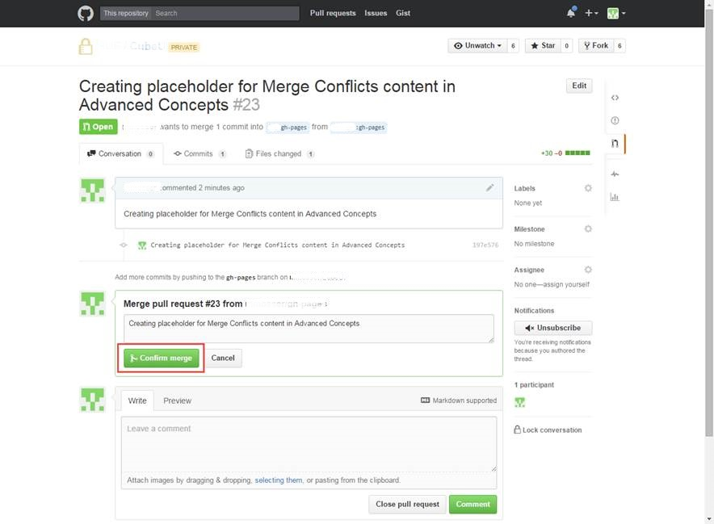
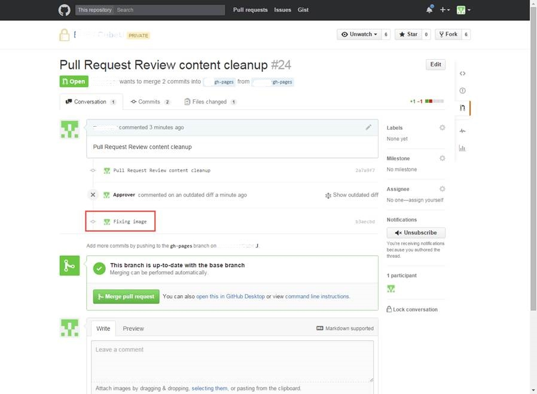
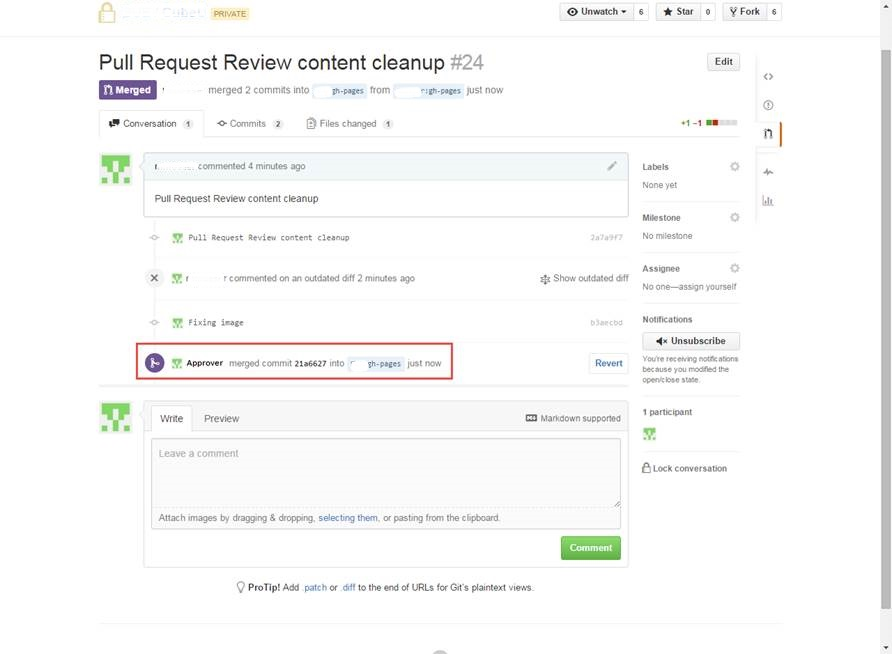
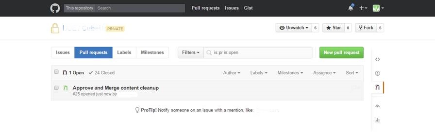
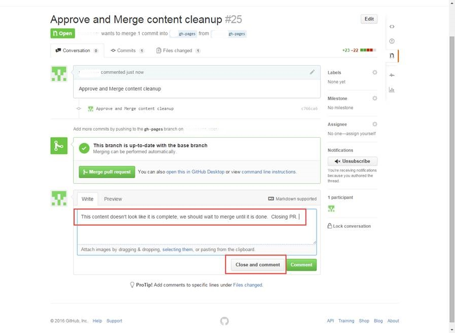
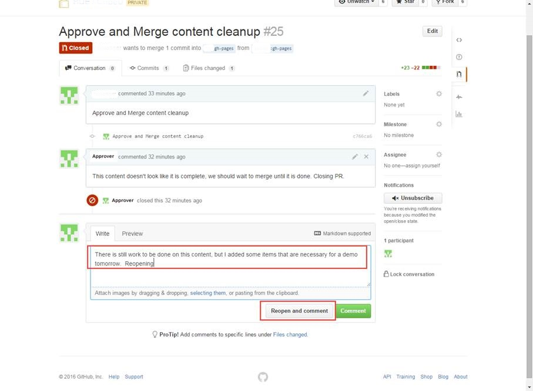
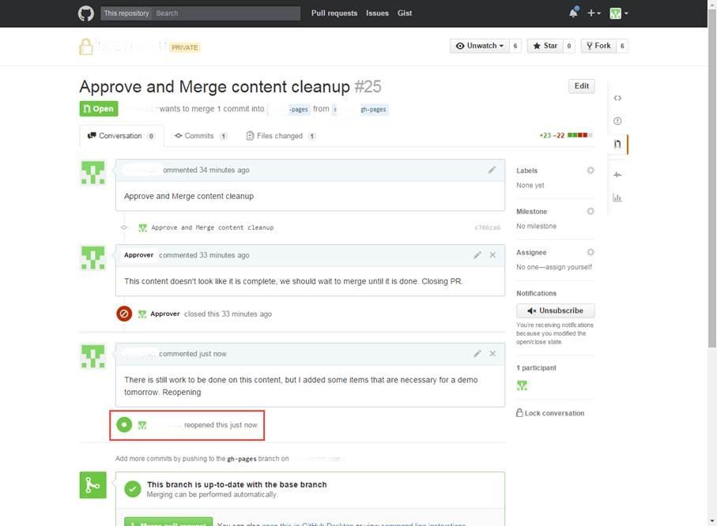



## Introduction

If an Approver approves of a Pull Request, they will perform a merge to move your
changes into the BASE repository.  If they choose *not* to approve the Pull Request,
they can create a comment for you see what they would like changed.  You can then
make your changes and push them to the same Pull Request for review again.
Alternatively, the Approver can close the Pull Request altogether, in which case
a new Pull Request would need to be created the next time you want to request
moving your changes to the BASE repository.  When a Pull Request is Closed, no
updates are made to any of the repositories and it is as though it was never created.

This section covers these Pull Request processes in more detail.    

## Prerequisites

* Before a Pull Request can be approved and merged, it must first be created from
your public GitHub repository.  See [Pull Request and Review]({{ site.github.url }}/1_SquirrelU/4_GitHub/2_basicConcepts/5_PullRequestReview/) for assistance.

## Approving a Pull Request

1. After a Pull Request has been created, navigate to the Pull Request View within
the appropriate repository; click on the title of the Pull Request you would like
to view

    {: .image}

2. If everything looks good and you would like to merge the changes into the BASE
repository, click the green **Merge pull request** button

    **Remember, only people with the Approver role will be able to take this action.
    If you are an Approver, but you are the one that submitted the Pull Request,
    you should request that another Approver review your changes and complete the merge.
    
    {: .image}
    
3. The title of the Pull Request will be auto-populated as the merge comment, but
you can change it to be more meaningful if you would like; when finished, click the
green **Confirm merge** button

    {: .image}
    
4. A note will automatically be generated in the **Conversation** tab noting that
the merge took place
     
    {: .image}

5. In the repository itself, a note will also automatically be generated listing
the most recent merge comment

    {: .image}

## Requesting Changes on a Pull Request

Requesting a change on a Pull Request is as simple as adding a comment, either a
general comment or at the line item level.  Commenting is covering in the
[Pull Request and Review]({{ site.github.url }}/1_SquirrelU/4_GitHub/2_basicConcepts/5_PullRequestReview/) section.

1. After a Pull Request has been created, navigate to the Pull Request View within the
appropriate repository; click on the title of the Pull Request you would like to view
   
    {: .image}
   
2. In this example, the Approver is making a line item comment for the requester
to change something
    
    {: .image}
   
3. Note that the comment is added to the **Conversation** tab of the Pull Request
    
    {: .image}
    
4. The requester then went back and made the requested change and pushed to origin;
note that the update is added to the currently open Pull Request

    {: .image}
    
    {: .image}
    
5. From there, the Approver can review the changes again and merge the changes as
outlined above
      
    {: .image}

## Closing and Reopening a Pull Request

1. After a Pull Request has been created, navigate to the Pull Request View within
the appropriate repository; click on the title of the Pull Request you would like
to view
   
    {: .image}

2. In this example, the Approver has reviewed the changes and is rejecting the
Pull Request; create a comment explaining the reason for rejection and click the
**Close and comment** button

    {: .image}
    
3. The Closure event is automatically recorded in the **Conversation** tab of the
request; at this point, no code in any of the repositories has been affected and
the process could end at this time.  The next time the requestor would like to
submit a Pull Request, they would simply create a new one

    {: .image}

4. If the requestor has reason to believe that the Pull Request should be opened
again, they can create a comment and click **Reopen and comment**

    {: .image}
    
5. The Reopen event is automatically recorded in the **Conversation** tab of the
request and the process can continue on in any of the manners as outlined in the
processes above

    {: .image}

#### How long to keep PR Open?
Your PR will remain open until it is deleted.  While some people may choose to 
hold a Pull Request open and continue to push to it, it is recommended that you 
delete your Pull Request after it is approved and merged to keep things clean.

  
{: .image}

## For Further Reading
