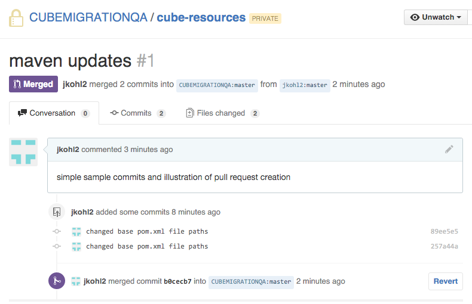
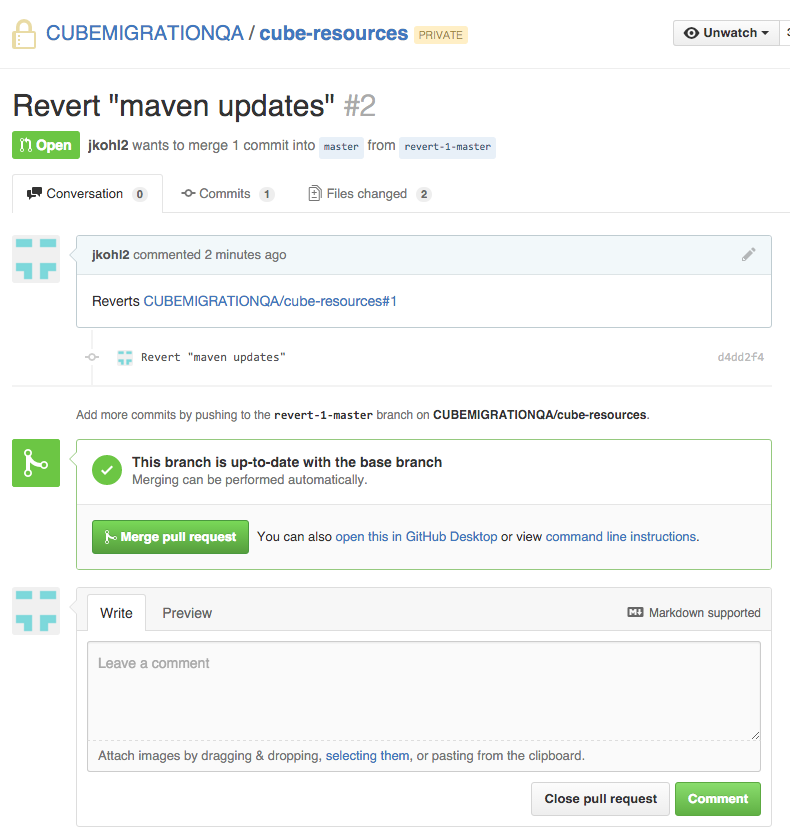
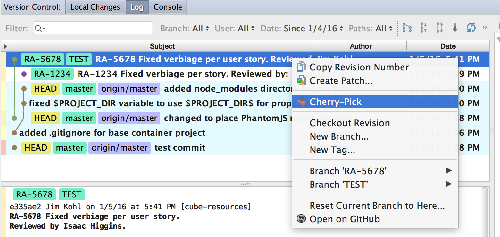
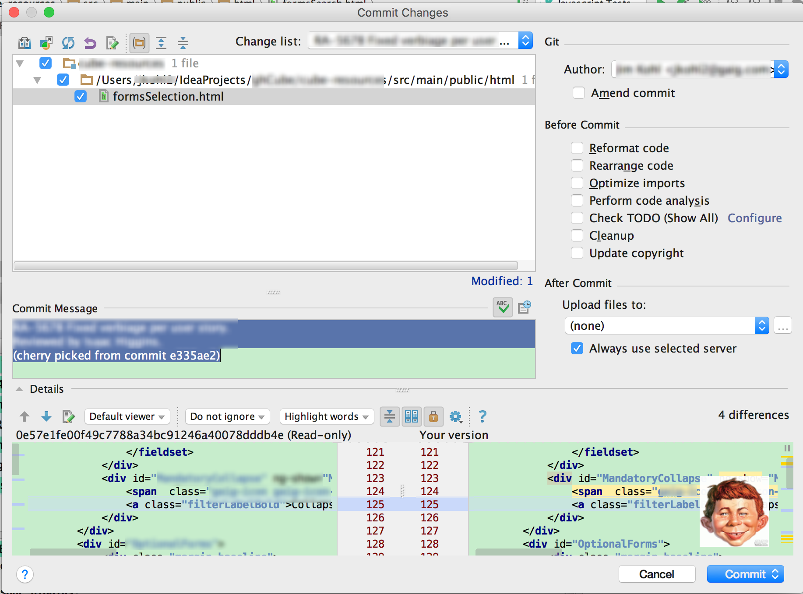
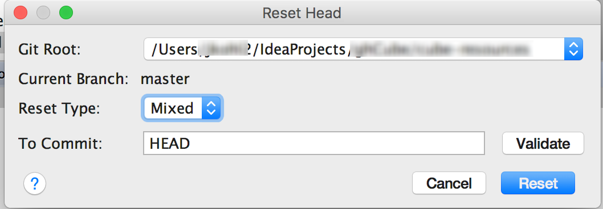



## Introduction

This section discusses techniques for reverting changes that have been made.

## Prerequisites

* Committed changes that you need to undo

## Undoing What You've Done  
You may realize that you want to discard a commit or completely go back to an 
older version.
  
You can use a variety strategies to accomplish this:

* Use IntelliJ's **Local History** to find an older version of your file and merge 
your changes by hand  
* Use Revert to a specific version

TODO:  add info on strategies, plus using stash, plus master, cherry picking, etc.

## Revert in GitHub
One technique that can be useful in undoing the most recent commit is to use the 
**Revert** button next to the recent merge in GitHub.
  
{: .image}

Once you click on it, a Pull Request will be opened for the Revert.

{: .image}

Click the **Merge pull request** button.

{: .image} 

Click **Confirm merge** and you're finished.

{: .image} 

## Cherry Picking
If you are needing to regress *some* code, you can use this technique, to pull an older branch / commit 
  and cherry pick it.  Once you commit it, it will merge into the master branch.

Select a branch:  
{: .image} 

View the commit's original comments and change list.  Select the portions which you want.  
{: .image} 

Once you've committed, you'll notice that the changes have been applied to master.
{: .image} 

## Reset
If you wish to bring the upstream Repository or your local repository back to a 
prior version, you can use Reset.

{: .image} 

#### Reset Type
Choose the reset Type based upon how you want to bring these changes back into your working tree:
 
 * **Mixed** (default) - The index is reset while the working tree is not (you'll get a summary).
  (changes preserved but not marked for commit). 
 * **Soft** - HEAD pointer is moved without updating the index and the working tree (your work remains intact)
 * **Hard** -  *both the working directory and index* are changed to the specified commit.  
 
#### Commit Point
 The Commit text box allows you to specify where you want to point the current HEAD to.
 You can specify via: 
 
   * a commit hash (SHA-1 index)  
   * an expression:  <branch>~<n>   
     where n = *number of commits backwards between the latest commit (HEAD) and the required commit*

TODO: discuss doing this in upstream processing.

## Use Local History 
This technique utilizes IntelliJ's **Local History** viewer to select, compare 
and revert to older versions.  You can use this technique to go back and change 
files individually, then recommit and push to upstream.  

TODO: add screenshot

## For Further Reading

* [Cherry Picking](https://www.jetbrains.com/idea/help/applying-changes-from-a-specific-commit-to-other-branches-cherry-picking.html)
* [Reset HEAD](https://www.jetbrains.com/idea/help/resetting-head-commit.html)