

## Introduction

Collaborating on code together with GIT is a bit different than with other code 
repositories.  Beyond pair programming at 1 PC, collaborating on code with GIT is a 
fairly painless process that doesn't deviate too much from working on any other story.

## Prerequisites

* None

## Setup Steps

There are a few one-time setup steps (for each person you want to work with) before 
you are able to get their code on your machine and begin working together.  

### 1. Add their fork(s) as a new remote

The first thing that needs to be done is to retrieve the GitHub URL for the person's fork. 
The easiest way to get this is from the GitHub page for the project(s) you need to work 
together on.

1. Click on the number next to the Fork link

    {: .image}

2. Click on the **Members** tab. This shows a list of everyone that has a fork of 
this repo.
    
    {: .image}
    
3. Click on the link next to the person whose fork you want to contribute to.  This will
take you to the page for their fork

4. From the fork page, click on the clipboard icon to copy their URL to be able to 
clone their repo locally

    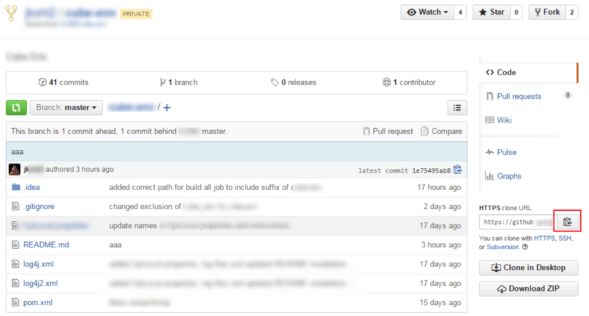{: .image}

5. From here, we need to use a CLI/console to add the remote to our own local git
        
    *  A bash console or 
    Cygwin needs to be used to run the following commands
    *  The console within IntelliJ 
    should work by default
     
6. From the CLI, run the following command to view what remotes you have available: 
git remote -v

    This shows all of your current remotes with the alias you chose and the URLs used 
    for them.

    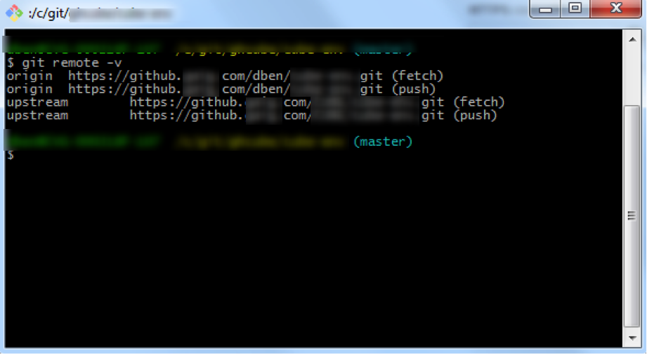{: .image}
    
    To add the person's remote run the following command: git remote add [alias] [GitHub URL] 
    	
    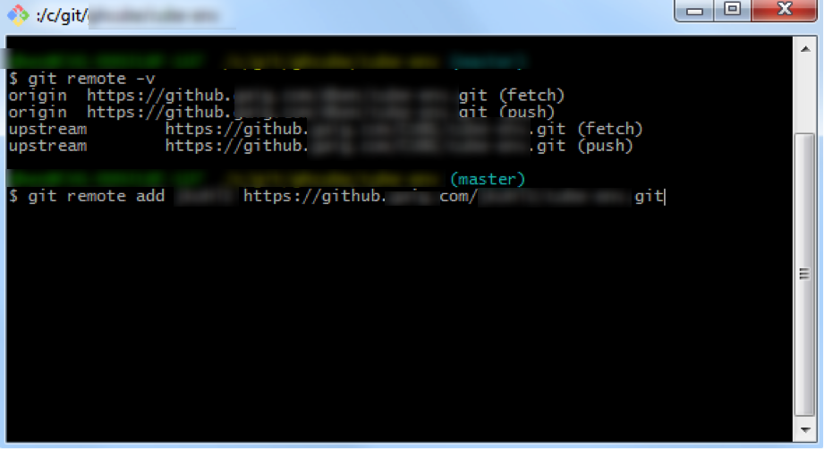{: .image}
    
    Running the previous command, git remote -v, again will show the newly added remote
 
7.	All that is left is to fetch their changes.  This can be done from the 
CLI (git fetch --all) or IntelliJ

    You may still need to do this in IntelliJ for IntelliJ to properly pick up the new 
    remote

    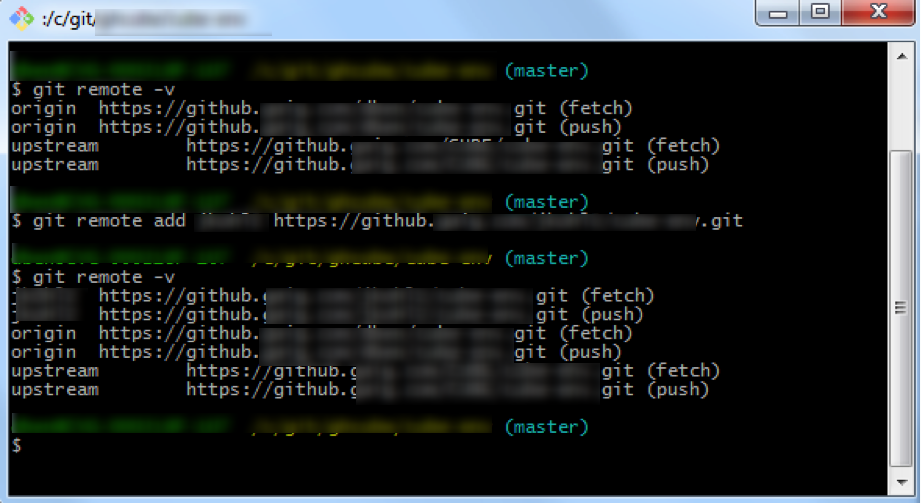{: .image}
    
    IntelliJ:
    
    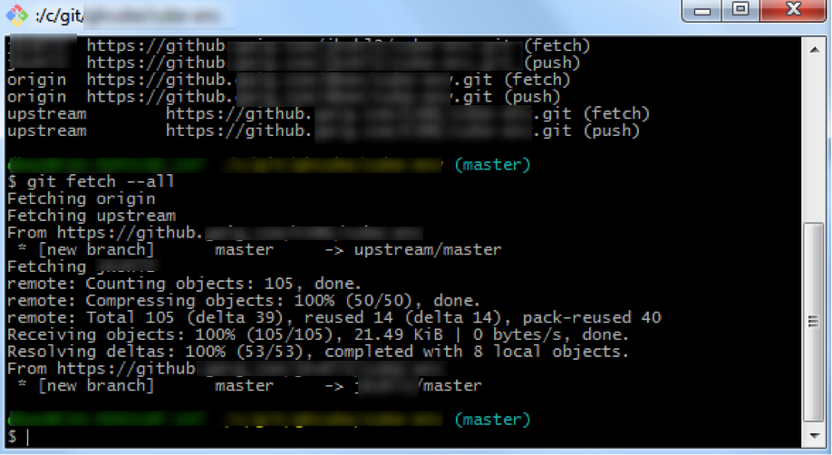{: .image}
    
### 2. Begin collaborating

1. Create a branch to work from.  Be careful when doing this if you are currently working 
on something else.  If you create the new branch from within IntelliJ, it will by default 
use the HEAD of wherever you are currently at as the HEAD of the new branch as well.  This
means that you could be adding changes unintentionally to someone else's work when you 
finally push your changes.

For the following examples the branch 'Zippy' will be used.

2. Now you can pull in the changes from the other person's branch to begin working on 
their code, or contributing your code to their branch.  In IntelliJ, go to Pull in the 
code like you would pull in upstream or origin, but select their remote instead

    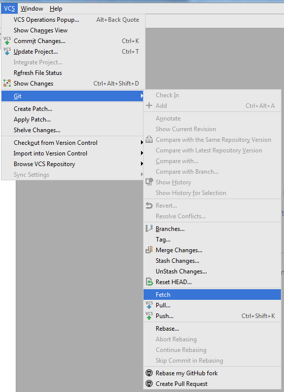{: .image}

    From here select the branch to pull in

    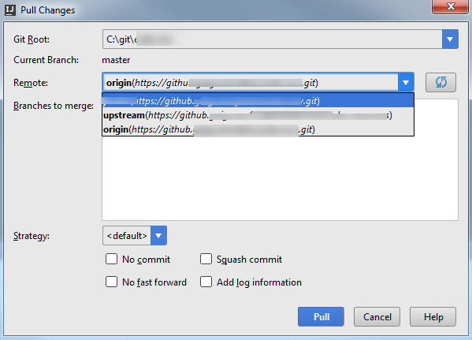{: .image}
    
    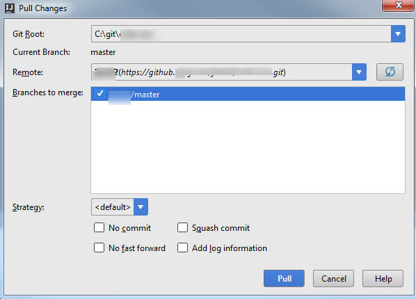{: .image}

    Once it's loaded, you will see the changes in the Version Control window
    
    {: .image}

    You can browse to their changes from here, or work as you would normally to 
    contribute additional work
    
3. Do the work you need to do and commit it!  Pushing the work to GitHub is the same as 
well

    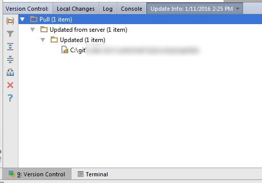{: .image}

4. Creating a Pull Request is where this differs from your main workflow, you want to 
create a Pull Request to the other person's repo instead of the Squirrel project

    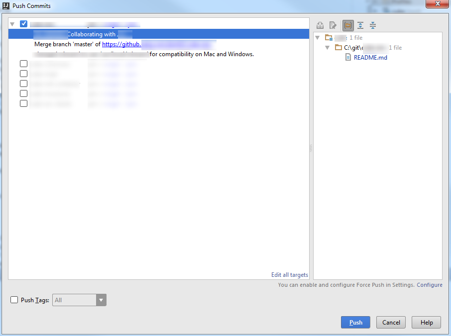{: .image}
    
    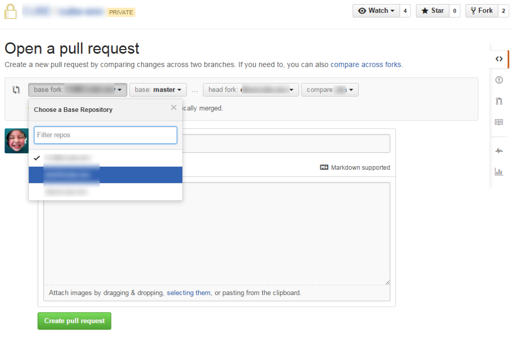{: .image}

    Once the Pull Request is created, it will be listed in that person's repo and they 
    should get an email that a Pull Request was created.  At this point, it functions 
    just like any other Pull Request, except that the person who owns the fork will need 
    to merge it in.

    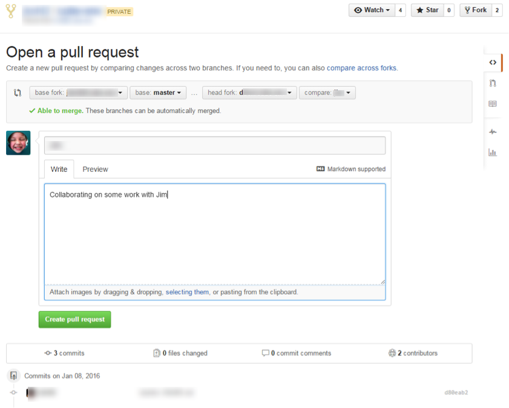{: .image}
    
    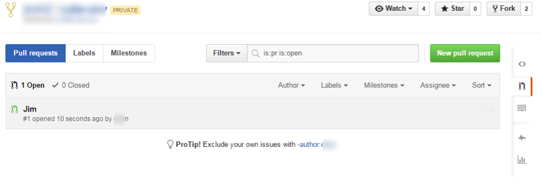{: .image}
 
5. Once the Pull Request has been merged into the person's public repo, they can then 
pull that code down to their local repo using Pull in IntelliJ just like they would 
when updating from the main Squirrel repo.

## For Further Reading

* Links