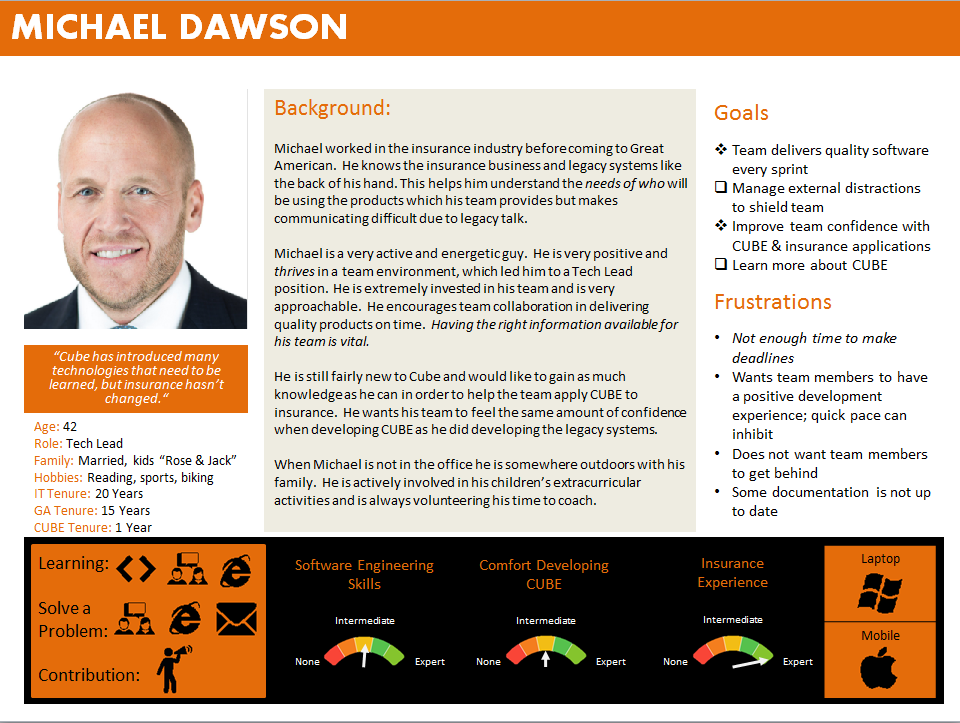



## Introduction

In designing CUBE University, we wanted to ensure we understood the needs of
those who would be using the site. To do this we used [Persona Based Design](http://www.agilemodeling.com/artifacts/personas.htm).  
Personas are fictional characters created to represent the different user types 
that might use a site or product in a similar way. Below we will explain our 
process as well as introduce the CUBE community's personas! 

## Prerequisites

* None

## Our Process

We created a survey to help discover goals, needs, experiences and learning 
styles of our development team of 60+ individuals. This survey contained 
questions about the responder’s work and personal life, aspirations, fears, how 
they prefer to learn and solve problems, as well as their thoughts they had 
during their first experience with Cube U. We interviewed about 1/3 of CUBE
developers and gained a lot of feedback.   

From the data we gathered we were able to understand the needs, goals, and
desires of our audience. We determined the preferred learning and problem  solving
styles that gave us an idea of what type of content should be included.

Understanding the goals of our audience was also important; this would allow us 
to maximize the effectiveness of the site. Many participants had recommendations  for improving the site, such as navigation functionality, new content areas and
nice-to-have items such as personalization. 

With all of the information we obtained we were able to create five personas, 
who we believe are a great representation of our development organization. 

We've captured important information about each persona. Here's a quick guide 
to this information.  

* **Personal Info**
* **Background**
* **Goals**
    *  - Survival goal
    *  - Aspirational goal
* **Frustrations**
* **Preferred learning & problem resolution methods**
    *  - Chat with team
    *  - Classroom
    *  - Code examples
    *  - Email
    *  - Online
    *  - Online classroom
    *  - Videos
* **Willingness to contribute**
    *  - Willing to contribute
    *  - Aspiring contributor
    *  - Low availability
* **Skill level in software engineering, CUBE, and insurance**
* **Device platform**

Let’s meet them! 

## Meet the Personas

**JESSE**  
This is Jesse, she was our key persona we designed the site around. She is new 
to the company as well as developing. We wanted her to be able to successfully 
navigate through the site and acquire the knowledge needed to develop in CUBE. 

{: .image}
 

**BRAD**  
Brad is still new to the company, but has a lot of developing experience. We 
wanted Brad to be able to grasp CUBE confidently, like he does software 
engineering. 

{: .image}
 

**ROHAN**  
Rohan is a Software Architect. He is very knowledgeable and would be a terrific 
contributor to the site, but he does not have much free time. When designing for  him, we wanted the contribution process to be smooth and time-efficient.

{: .image}
 

**TROY**  
Troy is a Modeling Architect. Like Rohan, we wanted to focus on a smooth 
contribution process for Troy. We also wanted to focus on his frustrations with 
finding the right information to resolve any problems he may come across. 

{: .image}
 

**MICHAEL**  
Michael is a very team oriented Tech Lead. When designing the site, we wanted 
him to be able to give his team confidence with the right information in order 
to deliver quality software. 

{: .image}

## For Further Reading

* <http://www.agilemodeling.com/artifacts/personas.htm>
 
 

