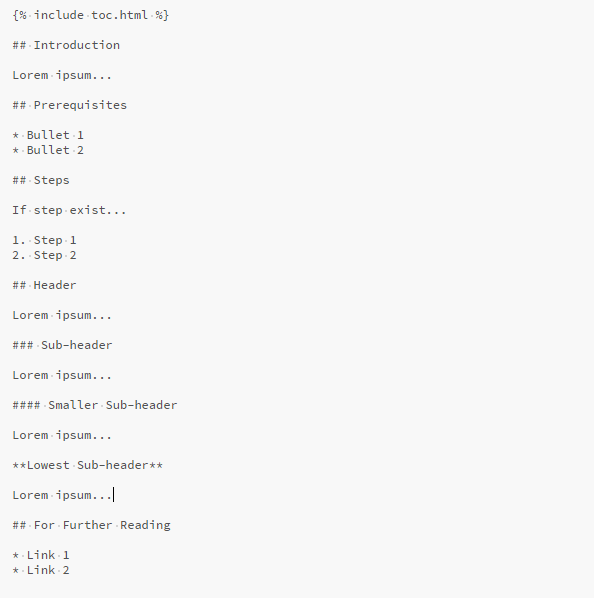



## Introduction

Jekyll breaks a page up into a few sections, including Front Matter and Content.

The Content includes the "meat" of the material for Cube U, including steps on
how to complete a process, information on a topic, supporting images, code 
examples, videos or anything else that is needed to convey information to the 
Cube U audience. Content always comes after a page's Front Matter.

This section will go through the standard content format for Cube U pages.

## Prerequisites

* 

## Example

Here is an example of the basic format of a Cube U page of content:

## Elements Explained

* **Contents** - This section is automatically generated by including 
    toc.html statement at the top of your content.
* **Introduction** - This section should include a few sentences or paragraphs 
    about the main topic, the purpose of the document or any other high level 
    information for the reader.  This section is mandatory.
* **Prerequisites** - This is a bulleted list of any tasks, steps or reading 
    that the reader should refer to prior to reviewing the content contained in 
    the page.  This could include items such as necessary downloads and installs 
    or knowledge a reader *must* or *is strongly recommended* to have in order 
    to fully understand the content. In general, a prerequisite should not 
    included content that is simply "good to know".  This section is mandatory. 
    If no prerequisites exist, the value of "None" should be indicated as the 
    first bullet point.
* **Steps** - If the content contained in the page is specifically a list of 
    steps required to achieve an objective, use the "Steps" header.  Subsequent 
    steps should be outlined within the section using *numbers* (bullets should 
    not be used for steps). This header is only required as needed.
* **Headers** and **Sub-headers** - The use of headers and sub-header is purely 
    at the discretion of the author or contributor. As many headers and 
    sub-headers may be used as necessary.  Keep in mind that every header 
    denoted with hashes (#) will be automatically included in the table of 
    contents.  Consider using the simple **bold** feature as a header if the 
    Contents list is too lengthy or if the content block is important to call 
    out, but not necessarily worthy of its own section.
* **For Further Reading** - This section should include a bulleted list of any 
    related material that the reader may be interested in reviewing to further 
    their knowledge of the topic.  These can be either external links to other 
    websites or internal links to related Cube U content. This section is
    mandatory. If no suggestions for further reading exist, the value of "None" 
    should be indicated as the first bullet point.

## For Further Reading

* Links

