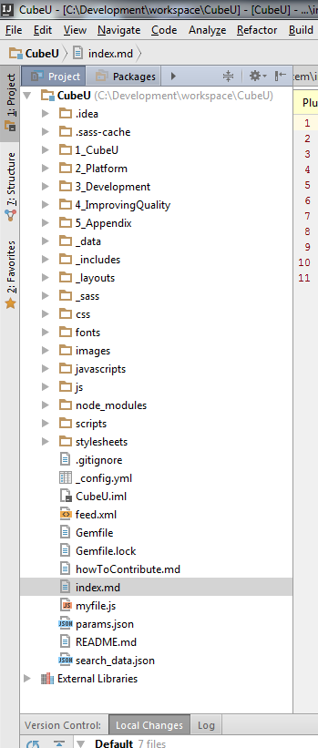
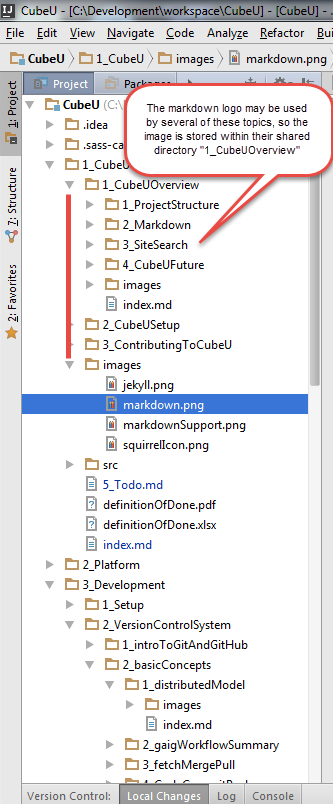



## Introduction  

This section dives into the file and directory content of CubeU Git Project.  

## Prerequisites

* Access to GAIG Enterprise GitHub and BUE/CubeU Repository. 

## Directory and File Structure

There are two ways in which Jekyll Pages is typically used:  
  1. Posts - this is a flattened, time based organization of content for blogging  
  2. Pages - useful for arranging content into some other form of hierarchy  

We are using Jekyll's "pages" concept, arranged into a content taxonomy of
folders and pages.

At the very top of the hierarchy, there is an index.md file. This is the first
page that gets loaded when you visit the site. This file contains links to
commonly referenced paths in the site. Alongside is a collection of nested
topic directories.

{: .image}  

**Main Topic Directories**

The rest of the Cube U hierarchy is composed of directories containing Markdown
files, images and other files as needed to provide code examples, videos, etc.

At its highest level, Cube U has been divided into 5 major sections: Cube U,
Platform, Development, Improving Quality and Appendix. 

{: .image} 

The **Cube U** directory contains content related to the Cube U platform and
does *not* contain any information specifically related to CUBE.

The **Platform** directory provides an introduction to CUBE such as its history,
functionality and architecture.

The **Development** directory contains content related directly to developing in
the application itself. It includes topics such setting up your CUBE
environment, its version control system and the various technologies associated
with CUBE.

The **Improving Quality** directory contains content related to testing, 
performance improvement, metrics and other strategies, tools and methods for 
improving the overall quality of the CUBE product. 

**Navigation Directories**

Within each of these 5 highest topic directories, there are a varying number of 
sub-directories we refer to as "summary directories". Each directory contains, at  
the very least, a 0_Summary.md file. This summary file typically doesn't contain  
a lot of actual content other than perhaps some overview dialogue and an 
automated list of the subdirectories contained within ("navigation"). 

Note that this summary file is *required* in order to generate the content
navigation as outlined below.

{: .image}

Rendered in Cube U:

{: .image}

**Content Directories**

At the lowest levels of the hierarchy are "content directories".  
These directories typically contain the "meat" of Cube U, with all of the
reading material, examples, videos and images that cover a particular topic.
Again, at a minimum, each of these directories contains an index.md file
containing the content itself. Other, supplemental directories may also be
included such as an images folder, a folder containing code examples, etc.

Note that each directory contains an index.md file.  This is *required* in order
to generate the content navigation as outlined below.

{: .image}

Rendered in Cube U:

{: .image}

## Standards

As mentioned throughout this section, at a minimum every section directory must 
include a 0_Summary.md file and every Markdown file must contain Front 
Matter. This is so that automatic hierarchy and content navigation can be 
generated. If there is any supplementary content to be included within the 
0_Summary.md file, it should be contained in peer directories as outlined below: 

* Images should be in a peer directory called "images"
* Code examples (JavaScript, HTML, etc.) should be in a peer directory called 
  "code" *if* they are contained within their own file (as opposed to being
  directly written in the content page itself)
* Videos should be in a peer directory called "video"

Directories should be named using CamelCase preceded by a #_ character (i.e. 
1_CubeUOverview). The numbering allows for topics to self-order. CubeU wants to 
keep content well organized with a number of sub-directories within a single 
directory to no more than 10 chapters (numbered 0 through 9). 

If a markdown file is used instead of a directory, Jekyll generates a directory 
with that name and places an index.html file inside of it. The images directory 
will no longer be a peer so any references to images in that images 
directory should reference the parent directory:  ../images

If an image is shared by more than one content file (for example, logos), it can 
be placed in an "images" directory that is a peer to the directory that the files  
share. However this practice should be kept to a mininimum as it 
makes content less portable.    

{: .image}

## _config.yml

The _config.yml file contains all configuration settings for the Jekyll site.  

The Jekyll configuration uses a Kramdown Markdown processor.   

### Smart Quotes
This processor by default uses smart_quotes, which turn ' and " characters into  
stylized smart quotes for publishing. These quotes present problems because 
if you have code containing quotes, these quotes will be turned into different  
characters.  Therefore, this option was overriden by using the following  
line:  smart_quotes: ["apos", "apos", "quot", "quot"]  

## Permalink: pretty Option

We are using the "permalink: pretty" option in the _config.yml file, 
which allows a link to simply reference a directory name.

{: .image}

This option does a couple of things:

1. It converts yourcontent.md file into a directory "yourcontent" and creates an 
    index.html file which will contain the content of yourcontent.md.

2. Any URLs that are shown will not show the .html extension 
    (such as "yourcontent.html"), but rather "yourcontent/"
3. The implication is that you have to be careful in referencing any images or 
    other supporting files because your point of reference will move from the 
    current directory to one directory down.  
4. However, "pretty" mode leaves index.md files in the same directory, without 
    creating a new directory.

## For Further Reading

* http://stackoverflow.com/questions/25596792/how-do-i-turn-off-smart-quotes-in-jekyll