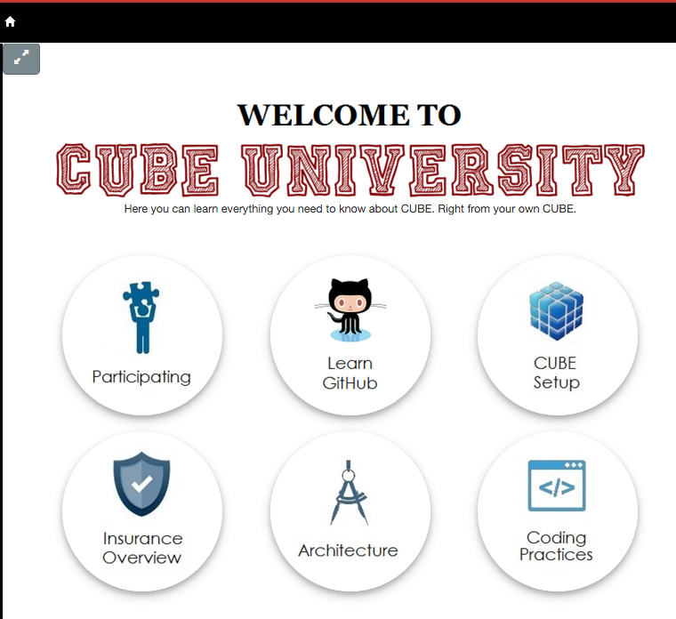
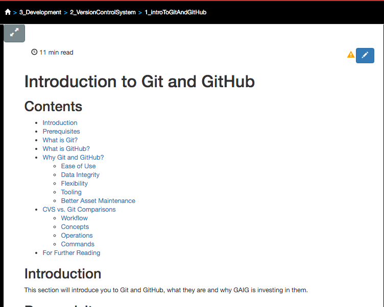
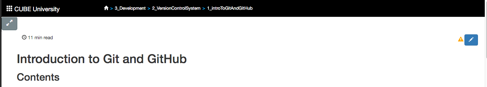
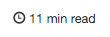



## Introduction  

Cube U was designed to help you explore new topics and quickly find the answers you need to get problems resolved quickly.

This section walks you through the various areas of the site and different ways to get where you want to go.

## Prerequisites

* The only thing you need before you get started is access to GitHub.  Requesting access is very easy and usually has a
  very quick turnaround time  Just follow the steps under the **Request Access to GitHub (Our Source Code Repository)** section
  of the **Required Access Requests for CUBE** page for instructions on gaining access.  Under the **Request Description** step, you'll
  just want to put "Please grant this user access to the BUE organization in GitHub"

## Featured Courses

On the front page of Cube U, you will find a set of the more popular course
section links. Course offerings will as new sections are offered.
  
You can always return to this page by clicking on the **Home** icon (looks like a house) in the breadcrumb
trail.  

{: .image} 

## Course Summary Page

After selecting a course, you will be taken to a summary page containing links to all of the content within that section.

Anytime you navigate to a new section or page, the content will be highlighted in the hierarchy to the left.

{: .image}

## Content Page

Each content page follows a similar structure providing a brief introduction, any 
prerequisites, content and a list of "Further Reading" links at the bottom of the 
page. 

{: .image}

## Convenience Features

Let's take a closer look at some of the navigational and convenience features on each page.

### Breadcrumb Trail

In some websites, breadcrumb trails are used to provide a set of previously 
visited links. Since a web browser provides adequate capability for doing this 
already, Cube U is using breadcrumb trails for a different purpose.
    
At the top of the page, a breadcrumb trail provides a quick navigation up and 
down the hierarchy. Clicking on any section to the left of the selected topic 
allows you to quickly return to an upper hierarchy level. The text displayed is 
based on the directory or file name to provide a consistent naming with the item 
in the GitHub file hierarchy.  

### Distraction Free Mode

 This icon toggles display of the left and right hierarchy
and search sections. 

{: .image} 

### Reading Time

 Estimated reading time for a selected page of content.

An average non-technical reading rate is an average of 275 wpm. 
Cube U calculates a rough reading time using a technical rate of 100 wpm. This
time may be adjusted based on actual usage over time. 

### Page Status

 "Under Construction" pages are marked with a 
cautionary symbol.

This symbol is also displayed in the content hierarchy. This 
symbol indicates that pages are not fully curated or some aspect of the page is 
under development. Once fully curated, this status should be changed in the 
page's Front Matter section to remove this icon.

### Edit Mode

 An edit button is displayed on content pages *only when you are on your own fork of Cube U*. This
Edit button takes you directly into GitHub to edit a content page.

**Always make sure that you are editing on the gh-pages branch. GitHub pages does 
not use the master branch.**

* This button will *not* appear while running Jekyll from localhost as you are
already editing within your IDE.

* This button will *not* appear on the "official" Cube U (main BUE/CubeU) pages because you should not directly
be making commits to this repository. To make changes to this content, you should be using Pull Requests. Use our **Quick Start**
guide under the Cube U section to get started contributing to Cube U.

### Table of Contents

For each page, a Table of Contents is generated from all the of the headings specified
in a page's Markdown (through the use of hashtags). The TOC provides context as to whether the page contains
relevant material per your search.  It also serves as a quick navigation option for
larger pages as each section is a direct link to that content.

### Page Sequence Navigation

{: .image} 

When you scroll downwards a number of lines 
in a page, a set of buttons will appear near the bottom of the page. 

If there is prior content in a sequence of content, a "previous" nav button 
containing the content title will appear on the left side of the page. 

The center button will take you back to the top of the page. 

If there is succeeding content, a "next" nav button containing the content title will appear on the right side of the page.

## Hierarchy/Left Hand Nav

At the heart of Cube U is the content hierarchy, where all content has been
arranged in a (hopefully) logical taxonomy of material. This hierarchy reflects 
the structure of directories in the Cube U repository.

This hierarchy appears in the left panel of your browser (if you're not in distraction-free mode).

{: .image}  

You can expand and collapse the whole hierarchy by clicking on the caret button 
at the top of the hierarchy. Individual sub-sections can be toggled opened and
closed. Currently, the site is set to expand only the section that you have selected
and close all other sections which you are not viewing.  

When you select a topic from the breadcrumb trail, search or use an internal link,
the topics's section will be opened and the topics will be highlighted.  

{: .image}  

Any pages still "Under Construction" are displayed with cautionary symbol in the 
content hierarchy. This symbol is also displayed on the page itself. 

## Search

{: .image}

Search provides a very fast keyword based search capability based on Page Title, 
Author, Tags (keywords) and a 20 word excerpt of the page. Therefore it is 
critical to pay close attention to the values placed into these fields, which are largely managed in a content page's
"Front Matter". Too many general tags will result in too many results for a given search. Too little will
leave the content unfound.  
 
Specify additional keywords in search to further refine the results.  Click a result to open the page for review.

## For Further Reading

* Need to know more about "Front Matter", which plays a *huge* part in the features outlined above? Take a look at our **Front
Matter Overview** page