

## Introduction

This section covers some strategies for managing the work around your Sprint deliverables using branches and stashes.

## Prerequisites

* Cloned Repository 

## Branching Strategy
<span class="octicon octicon-git-branch" style="font-size: 58px"></span>{: .right}

One strategy for managing your work is using branches.  
You create your own branches for working on features.  
Each branch can be used as a container for your changes all the way through a Pull Request.
You can commit directly to a branch and even generate pull requests from these.   

### Branches <span class="octicon octicon-git-branch" style="font-size: 20px"></span>
The concept of a branch in IntelliJ is a lightweight container which contains versions of files that you are currently working on.  

Each branch points to a specific SHA-1 commit point.  By default the master branch is your working branch.   

By switching to a different branch, the Git head is changed to the specified branch's SHA-1 and  
therefore you are pointing to a different set of file versions, immediately available in your CLI or IntelliJ.  

### Checkout
You switch branches by using the Git checkout command or in IntelliJ checkout branch.  
Checkout can be used with the -n option to create a new branch.
If a new branch is created, it is built as a replica of the current branch but will proceed with all of its new changes.  

To switch between master and any other branch, you will used the checkout command, which is also available in IntelliJ:
{: .image}

To see and select the active branch in IntelliJ, go to the lower right hand corner of your screen.  
Click on the dropdown to checkout to a different branch, and you IntelliJ will update the code base to match the branch.  
{: .image}

### Feature Branches
In some corners, such branches are called Feature branches around the idea that it is used for working a sprint feature.
When completed, tested and reviewed, it will be merged back into the Repository's master branch typically before the end of a sprint.  
Feature branches should be closed at the end of a sprint, however if not finished, it can be held open over a sprint to be completed.  
If an issue is discovered after Sprint closure, the feature branch could be kept around to be adjusted.
However eventually all closed branches should be removed.  

Such feature branches are brought back to the master branch via checkout and merge.  
A feature branch is simply a branch with an intended usage.  

To identify branches, we will be using the JIRA ticket number.

### Example 1: Using Feature branch for your first task

You will always start out on the master branch.  

Let say that you've changed two files.  
Until you've made commits of these changes to any branch,  
they will show up in the Version Control Window, no matter which branch you select.  
{: .image}

Now you decide that each of these files will go into two different JIRA stories.  
You decide to create a branch for each story.   

First setup a new feature branch with the name of the first JIRA ticket number (RA-1234).
Note that branches are attached to the repository clone; they do not span repositories - important if you are working 
with multiple repositories.

In the Git branch viewer, select your desired Repository, right click and select New Branch:
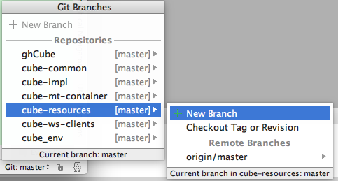{: .image}

Enter a branch name:  
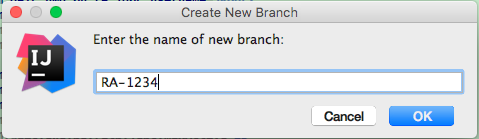{: .image}

Once the branch is created, you'll be switched to that branch.  
This is equivalent to:  ```git branch checkout -b RA-1234```  
{: .image}
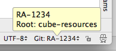{: .image}
At this point you are no longer working on the master branch.

Proceed to commit your changes to RA-1234.  
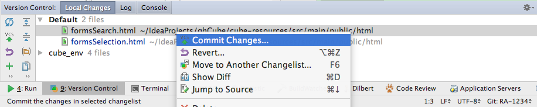{: .image}
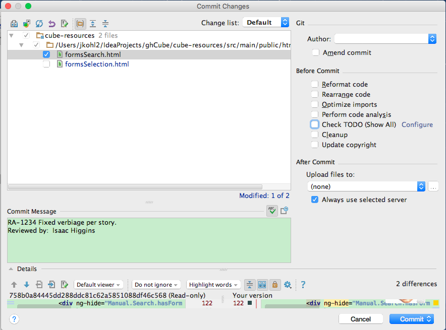{: .image}

Now the branch viewer indicates divergence from master.
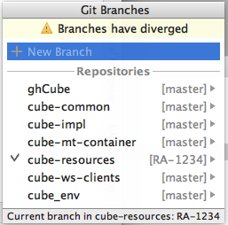{: .image}

### Example 2: Jumping between Feature branches 
You have more work to do in this sprint.  Lets open a second feature branchj for feature RA-5678.
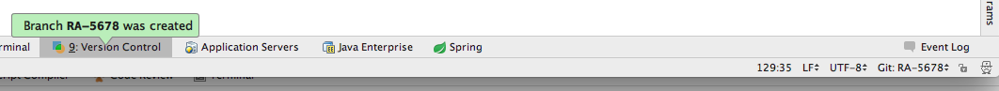{: .image}

Now commit the second file into this second feature branch, RA-5678. 
{: .image}
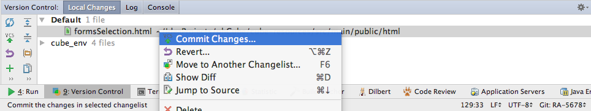{: .image}

The product owner just requested a change to your original feature.  
So switch back to feature branch RA-1234.  Your work on the second feature remains intact until you need it.  
{: .image}

Make, commit and test changes to feature RA-1234. 
{: .image}

Lets see the changes as they appear in the VCS Log Viewer, which is an IntelliJ tool for GitHub.

By clicking on the RA-5678 branch, we can see the commit changes:
{: .image}

Then by moving down to RA-1234, we can see its commit changes::
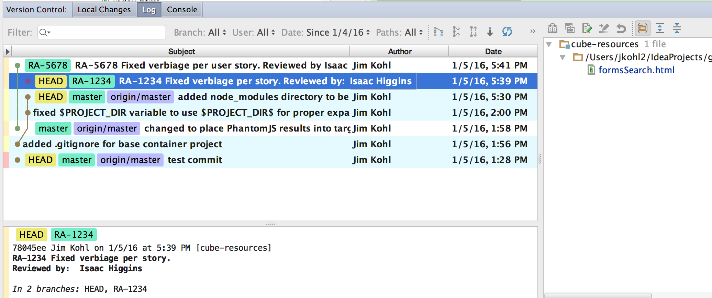{: .image}

You now have two features with changes that need to be pushed to your public fork, discarded or put away for later disposition.  

### Example 3: Promoting a Feature Branch
Lets take feature RA-5678 branch and push it up to your public fork for review and approval.    

First lets pull in changes from upstream to make sure that we are keeping current.
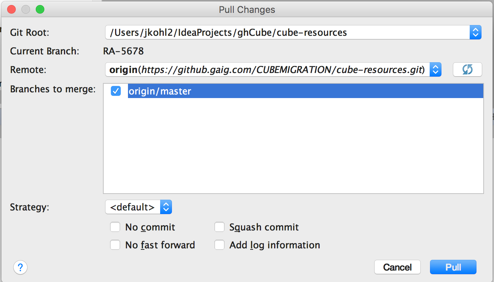{: .image}
Select your branches to pull from:  
{: .image}

Now we can push our feature branch RA-1234 changes to our public fork.
TODO: checkout master

Lets initiate a pull request for this feature.  
After some period of review, our tech lead merges this into master.
As long as we've kept up to date with the Repository master and that you have no conflicting file changes between feature 1 and master, 
merging is a straightforward process.  

Once the merge has occurred and the pull request has completed, the pull request should be deleted. 
However the branch is still present in your private and public branch.  
It is recommended that you keep this around for a sprint in the event of any change.
Then delete the completed branch.
To delete the branch, switch to another branch so that you can delete the branch you wish to delete.  
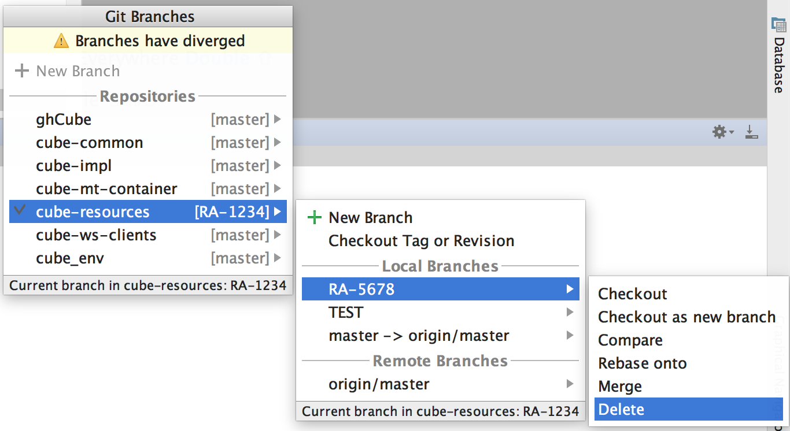{: .image}

Make sure that you bring your feature RA-1234 and RA-5678 changes back into your local master branch 
 to get rid of the diverging branches message in the branch viewer.  

This same process can be repeated for feature RA-1234 (pull any upstream changes, push changes, initate pull request).  

### Branches and Testing 
Make sure that you are well aware what your active branch is when you are running your application, JavaScript, Hudson and JUnit tests.  
{: .image}

Whatever you test successfully, you should isolate your testing to a specific feature that you are working on in testing.  

## Stash / Unstash
An alternate strategy for managing your work is to use Git Stashing/Unstashing.  
Stashing utilizes a stack concept for managing your changes.  
By pushing and popping, you can can effectively change the branch content that you are working on.  

From there you can push and pop content into Feature Branches, or onto your master.
After that you can generate Pull Requests as you would do in the GAIG workflow.

In the scenario we walked through earlier, you could stash the content for RA-5678 onto the stash stack.  
{: .image}
Select the name for your stash. 
{: .image}

Later when its time to retrieve this item, select Unstash.
{: .image}

You have a choice to apply the stashed patch to your current branch (which will retain it in the stash): 
{: .image}  

Or you can pop the stashed patch off of the stack onto your current branch (and then it will no longer exist in the stash):  
{: .image}  
Note now that the stash is empty: 
{: .image} 

You can use stash with any branch, and carry stash changes to any other branch. 
{: .image} 
 
## For Further Reading

* [GitHub Secrets](https://github.com/blog/967-github-secrets)