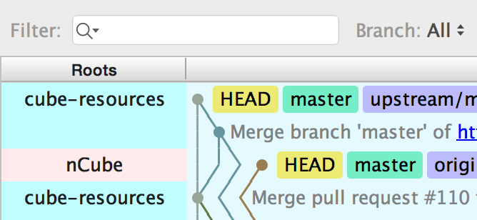
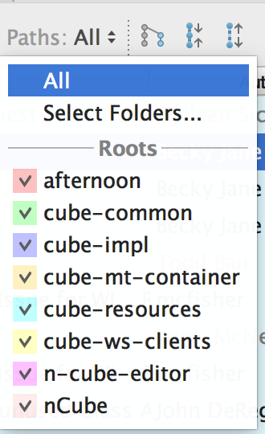
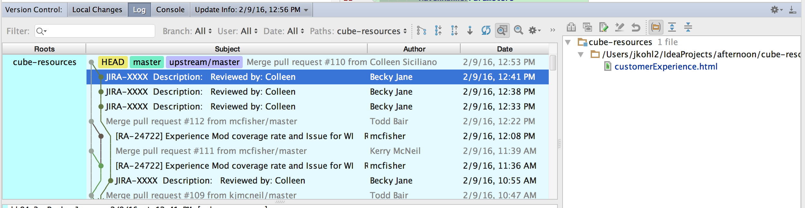



## Introduction

Git provides the 'git status' command to track the status of files and their various states (modified, staged, committed).  

IntelliJ provides the Log utility which displays all git status information in a graphical fashion.  

## Prerequisites

* IntelliJ installed
* GitHub account
* GitHub plugin installed (TODO: setup here)
* Understanding of Git commands

## Finding the Log  

You can find the Log by selecting Version Control in IntelliJ's bottom gutter.  
{: .image}

Within Version Control, click on the Log tab.  
{: .image}

## Expanding the Roots for Viewing  
By default, each Root is not shown.  
{: .image}

To turn Root display on, toggle the arrow on the left side of the Log. 
{: .image}

## Filter 
You can narrow results by keyword, Branch, User, Date and Paths.  
Filtering by author or other keyword can quickly help you find a recent commit that you need to look at.  

### Narrowing Repository Paths  
By default, the Log shows every Repository that you've brought into your IntelliJ project.  
At times this might seem like information overload, especially in CUBE with 6 projects!  
{: .image}
 
You can use the "Paths" dropdown to fine tune the Repositories (roots) which you want to view.  
{: .image}

Use it to toggle on/off any Repositories which you are interested in.   
{: .image}

Select a repository one at a time.   
{: .image}

If you press the Control key while clicking on a repository with your mouse, you can narrow down the selection to only that Repository.  
{: .image}

This narrower view will help you in isolating where your local repository stands in relation to base repository.     
{: .image}

## Viewing Specific Commit Detail
By selecting an individual commit, you can see the files that were changed listed over on the right hand side.  
{: .image}

## Understanding branching and status
You will see a number of colored items as follows:
 * remotes are blue.  Unfortunately IntelliJ does not distinguish origin from remote.  
 * master is green
 * HEAD pointer is yellow  
 
At some point your cloned Repository will diverge from the Base Repository.  
You can see the degree to which your branches are behind the Base by looking at the position of the colored tags.  

### Behind master

### Now up to date

## Getting even with Base  

## IntelliSort  

## For Further Reading

* Links
