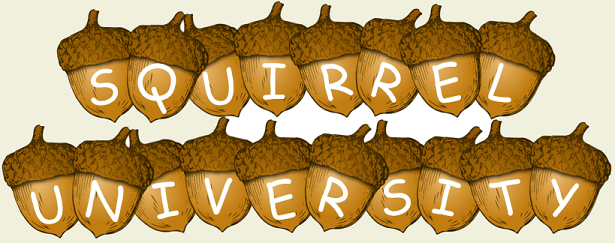
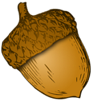

    

        

            
             
        

    

     

    

    Welcome to Squirrel University!  
    Here find everything you need to know about developing at Squirrel Works!
     
    

     

    

        Check out 
        <a href="{{ site.github.url }}/images/TransformingTribalKnowledge.pdf">Zippy's Story</a>
         presented @ CodeStock2016 in Knoxville, TN!
         
    

    

        Check out 
        <a href="{{ site.github.url }}/QuickCard/SquirrelUQuickCard.pdf">Squirrel U QuickCard</a>
        for a quick reference.
         
         
        Come Join our squirrelly adventure!  
         
        Create an issue in the repository for any ideas, errata or bugs. 
         
         
        <a href="{{ site.github.url }}/credits">CREDITS</a>
    

    

        

            
        

        
        

            
        

    
        

            
        

    

